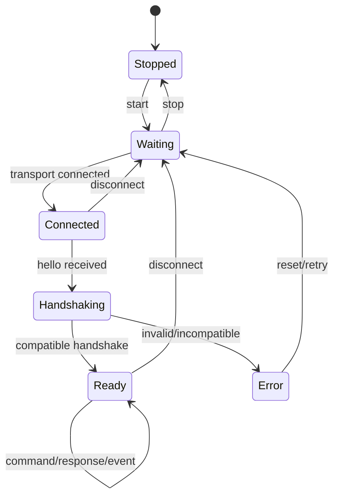

# State Machine:HostLink Session

## State owner

SessionRuntime holds connection generation, negotiation capability, RX parser, pending request and TX queue. Transport only generates connect/disconnect/bytes events; Handler does not hold session state.

## Guard and Action

Connected can only be entered after the transport link is established; Handshaking can only be entered after Hello is complete and the version/capability can be verified. Any command frame before Ready returns a protocol error. Ready's self-loop completes decode, route, handler and ordered response each time.

## Error classification

Command-level rejected remains Ready; broken framing, version incompatibility, continuous overrun enters Error and cleans up parser/pending. Disconnect returns from any connected state to Waiting and invalidates any old callback generation.

## Idempotence and backpressure

Start/stop is idempotent; the same as the seq side effect command to deduplicate the pending/committed result. RX/TX uses a fixed capacity. When the queue is full, the contract returns Busy or closes the out-of-control peer, prohibiting unbounded growth.

## Testing

Cover command-before-handshake, invalid hello, half frame, disconnect during handler, fast reconnect, repeated seq, TX full and Error reset.
