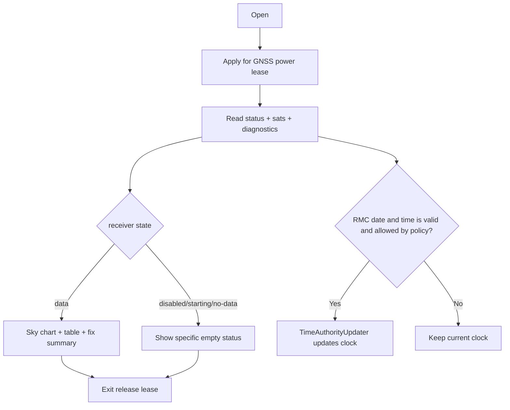

# Activity: GNSS diagnostics and time update

## Questions answered by this picture

How users judge GNSS Is it shut down, starting up, no data, no fix, or working normally, and when to allow GNSS time to update the system clock. Sky maps, diagnostic tables, positioning and time updates use the same revision snapshot to avoid conflicts with each other.

## Snapshot content

The snapshot contains at least receiver state, satellite list, fix validity, position/accuracy, NMEA revision, diagnostic count and candidate RMC date and time. Missing fields must be displayed as unknown, and the value from the previous revision cannot be used to pretend that it is currently valid.

## Time authority rules

Only call `ITimeAuthorityUpdater` when the date, time and revision are all valid and the policy allows GNSS to be the current time source. No fix does not have to automatically negate all time inputs, but must be arbitrated according to the implementation's RMC trust conditions. Old revisions, significant transitions, or duplicate inputs must not rewind the system clock.

## Empty state

Disabled, Starting, NoData and NoFix are different states: the first two involve power/initialization, NoData involves the receiving chain, and NoFix means that satellite data is received but the positioning conditions are insufficient. Combining them into "GPS unavailable" hides actionable diagnostics.

## Resources and Exit

The page remains available to the receiver during diagnostics via a power lease; exit, page destruction, or acquisition failure must release its own lease. Releasing a page lease is not equivalent to turning off GNSS used by Tracker, Navigation or other owners.

## Source code and testing

`LocationService`, GNSS status/diagnostics snapshot and `ITimeAuthorityUpdater` are the main boundaries. Tests cover revision deduplication, expired satellites, legal/illegal times without fixes, clock rollback protection, and lease sharing.
