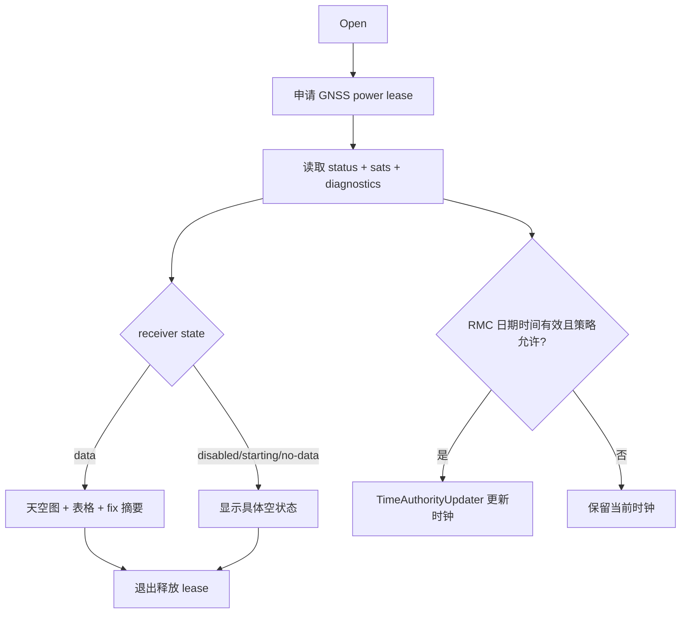

# Activity：GNSS 诊断与时间更新

## 本图回答的问题

用户如何判断 GNSS 是关闭、启动中、无数据、无 fix 还是正常工作，以及何时允许 GNSS 时间更新系统时钟。天空图、诊断表、定位和时间更新使用同一 revision 快照，避免相互矛盾。

## 快照内容

快照至少包含 receiver state、卫星列表、fix validity、位置/精度、NMEA revision、诊断计数和候选 RMC 日期时间。缺字段必须显示 unknown，不能沿用上一 revision 的值伪装当前有效。

## 时间权威规则

只有日期、时间和 revision 均有效，且策略允许 GNSS 成为当前时间来源时，才调用 `ITimeAuthorityUpdater`。无 fix 不必自动否定所有时间输入，但必须按实现的 RMC 可信条件裁决。旧 revision、明显跳变或重复输入不得倒退系统时钟。

## 空状态

Disabled、Starting、NoData 和 NoFix 是不同状态：前两者涉及电源/初始化，NoData 涉及接收链，NoFix 表示收到卫星数据但定位条件不足。将它们合成 “GPS unavailable” 会隐藏可操作诊断。

## 资源与退出

页面通过 power lease 保持诊断期间接收器可用；退出、页面销毁或获取失败都必须释放自己的 lease。释放页面 lease 不等于关闭被 Tracker、Navigation 或其他 owner 使用的 GNSS。

## 源码与测试

`LocationService`、GNSS status/diagnostics snapshot 和 `ITimeAuthorityUpdater` 是主要边界。测试覆盖 revision 去重、过期卫星、无 fix 的合法/非法时间、时钟倒退保护和 lease 共享。
