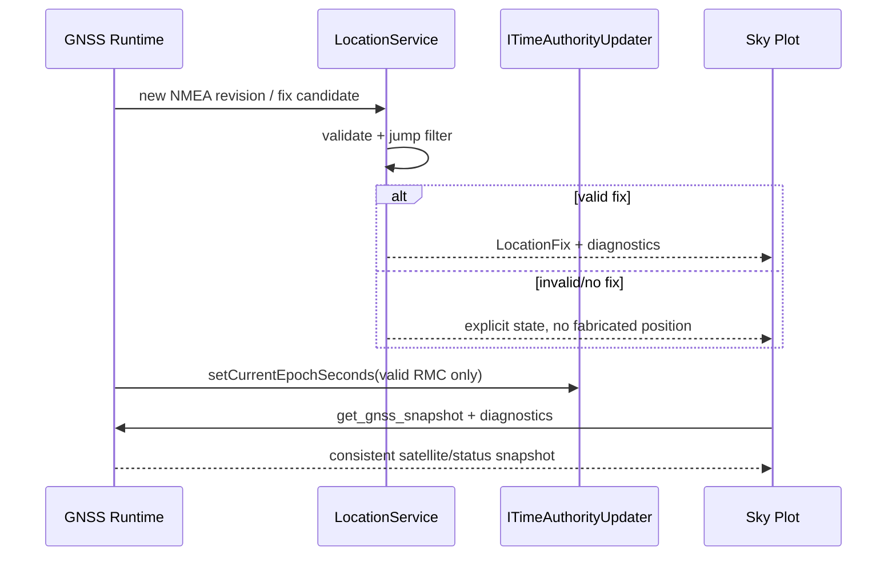

# Sequence: GNSS snapshot to position and clock

## Scenarios and responsibilities

Driver provides NMEA revision and raw diagnostics; LocationService validates candidates, performs jump filtering and has the latest fix; Time port only accepts RMCs that pass the policy; Sky Plot consumes snapshots and does not participate in position or time adjudication.

## Revision rules

The same NMEA revision cannot update the Location or system clock repeatedly. LocationFix and diagnostics record the revisions that generated them, and the UI uses the same snapshot to display satellites and status to avoid new satellite tables being equipped with old fixes.

#

The effective position and effective time have different guards. `Driver -> Time` in the figure must pass the verification boundary of time policy/LocationService in implementation; Driver cannot directly become the business time authority just because it resolves RMC.

## Jump and failure

When the candidate position is rejected by the jump filter, the last trusted fix is ​​retained, but the projection identifies that the current revision does not produce a new fix. A failed Time update does not undo the position commit; vice versa. The cause of the error is reserved for diagnostics.

## Testing

 Covers duplicate revisions, position valid/time invalid, time valid/no fix, transition rejection, clock rollback and snapshot read concurrency.
