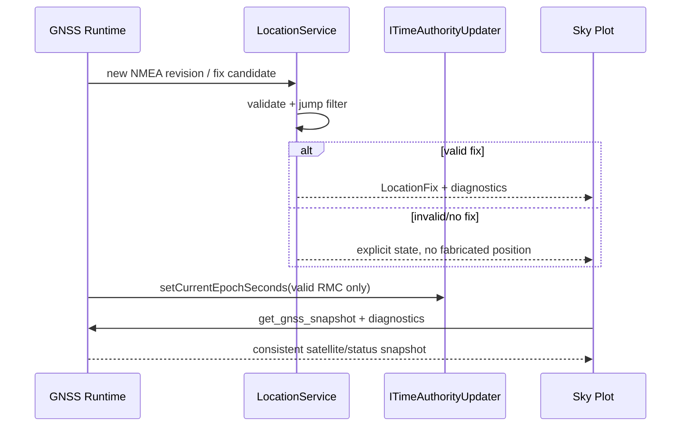

# Sequence：GNSS 快照到位置与时钟

## 场景与责任

Driver 提供 NMEA revision 和原始诊断；LocationService 验证候选、执行跳变过滤并拥有 latest fix；Time port 只接受通过策略的 RMC；Sky Plot 消费快照，不参与位置或时间裁决。

## Revision 规则

同一 NMEA revision 不能重复更新 Location 或系统时钟。LocationFix 与 diagnostics 记录产生它们的 revision，UI 用同一 snapshot 展示卫星和状态，避免新卫星表配旧 fix。

## 位置与时间分离

有效位置和有效时间具有不同 guard。图中的 `Driver -> Time` 在实现上必须经过时间策略/LocationService 的验证边界；Driver 不能因解析出 RMC 就直接成为业务时间权威。

## 跳变与失败

候选位置被 jump filter 拒绝时保留上一可信 fix，但投影标识当前 revision 未产生新 fix。Time update 失败不撤销位置提交；反之亦然。错误原因保留为诊断。

## 测试

覆盖重复 revision、位置有效/时间无效、时间有效/无 fix、跳变拒绝、时钟倒退和 snapshot 读取并发。
