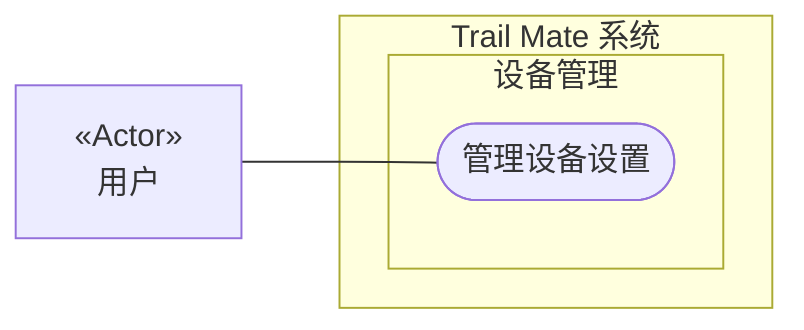

# 用例图：管理设备设置

<!-- praxis:use-case-diagram:start -->

## 元数据

项目版本：0.1.30-alpha
设计文档版本：0.1.30-alpha
Git 分支：main
Git 提交：34aad0bffa2f6450192f655f248a94b6c3cbd767
Git 工作区状态：dirty
Agent 版本决策：none - 本次渲染没有单独的 agent 版本决策
更新于：2026-06-25T14:17:55.307Z
来源：Agent 候选分析
所属地图：../use-case-diagrams-maps.md
语义 HTML：manage-device-settings.html

## 身份信息

- ID：use-case:manage-device-settings
- 业务边界路径：Trail Mate 系统 / 设备管理
- 当前边界类型：业务模块
- 当前边界职责：提供设备状态的可见性和用户可控的硬件管理
- 状态：candidate
- 置信度：medium
- Markdown 路径：docs/design/use-case-diagrams/manage-device-settings.md
- HTML 路径：docs/design/use-case-diagrams/manage-device-settings.html
- 触发条件：用户从导航栏进入设置页面

## 故事摘要

用户打开设置页面，查看和修改设备参数，如界面、声音、网络等

## 参与者

- 用户（个人）

## 外部系统

- 无

## UML 下钻地图

- Use Case Diagram：[管理设备设置](manage-device-settings.html)
  - Activity Diagram：[业务流程：管理设备设置](manage-device-settings/activity.html)
  - Sequence Diagram：[对象交互：管理设备设置](manage-device-settings/sequences/sequence-manage-device-settings-sequence.html)

## Mermaid 用例图



## 设计指标索引

此章节是 Design Explorer 可解析的指标索引。每个数字都必须能回溯到这里的具体条目，避免 UI 只展示不可解释的计数。

| 指标 | 数量 | 内容边界 |
| --- | ---: | --- |
| 节点 | 4 | 参与者、外部系统、上下文和当前用例。 |
| 关系 | 5 | 当前用例与上下文、参与者、外部系统或其他用例之间的关系。 |
| 证据 | 2 | 支撑当前候选用例的文件、代码证据、规范或推断证据。 |
| 待裁决 | 0 | 仍需产品或业务负责人裁决的外部问题。 |

### 节点

- Trail Mate 系统（业务边界：系统边界） - 管理整个应用的用户目标和业务能力
- 设备管理（业务边界：业务模块） - 提供设备状态的可见性和用户可控的硬件管理
- 管理设备设置（用例） - 用户打开设置页面，查看和修改设备参数，如界面、声音、网络等
- 用户（参与者） - 使用 Trail Mate 设备的最终用户，可以查看状态、收发消息、配置设备、使用诊断工具

### 关系

- Trail Mate 系统 包含业务边界「设备管理」（包含关系）
- 设备管理 包含 Use Case「管理设备设置」（包含关系）
- 用户 作为主要参与者参与「管理设备设置」（参与关系） - 使用 Trail Mate 设备的最终用户，可以查看状态、收发消息、配置设备、使用诊断工具
- 用户 -> 管理设备设置（参与关系） - 用户管理设置
- 用户 -> 管理设备设置（参与关系） - 用户管理设备设置

### 证据

- 证据 1 · 本地仓库扫描 · apps/linux_uconsole_gtk/src/platform/gtk/gtk_uconsole_settings_logic.cpp · 1-1（FACT:strong） - 设置页面逻辑

  ```text
  refreshSettingsPage, showSettingsPage, makeSettingsPageLifecycle
  ```
- 证据 2 · 本地仓库扫描 · apps/linux_uconsole_gtk/src/platform/gtk/gtk_uconsole_settings_logic.cpp · 1-1（FACT:medium） - 设置逻辑实现

  ```text
  settings_logic.cpp
  ```

### 待裁决

- 无

## 主成功路径

1. 用户打开设置页面，查看当前各项配置
2. 用户修改某项设置（如音量、屏幕亮度等）
3. 系统保存新值并应用
4. 用户选择设置页面
5. 用户修改某个设置项
6. 系统保存新值并通知相关模块

## 备选路径

1. 无

## 失败路径

1. 无

## 证据

| 来源 | 路径 | 行号 | 强度 | 摘要 |
| --- | --- | --- | --- | --- |
| 本地仓库扫描 | apps/linux_uconsole_gtk/src/platform/gtk/gtk_uconsole_settings_logic.cpp | 1-1 | strong | 设置页面逻辑 |
| 本地仓库扫描 | apps/linux_uconsole_gtk/src/platform/gtk/gtk_uconsole_settings_logic.cpp | 1-1 | medium | 设置逻辑实现 |

## 变更记录

### 0.1.30-alpha - 2026-06-25T14:17:55.307Z

变更类型：DISCOVERY
版本决策：none - 本次渲染没有单独的 agent 版本决策


Git 分支：main
Git 提交：34aad0bffa2f6450192f655f248a94b6c3cbd767
Git 工作区状态：dirty

摘要：
- 恢复或更新候选用例图「管理设备设置」。

<!-- praxis:use-case-diagram:end -->
