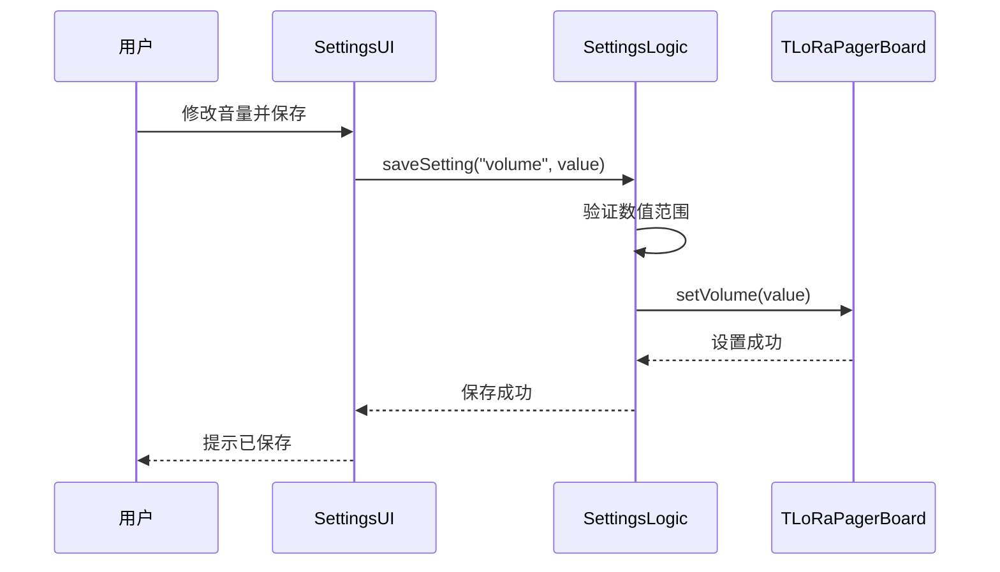

# Sequence Diagram：对象交互：管理设备设置

<!-- praxis:use-case-diagram:start -->

## 元数据

项目版本：0.1.30-alpha
设计文档版本：0.1.30-alpha
Git 分支：main
Git 提交：34aad0bffa2f6450192f655f248a94b6c3cbd767
Git 工作区状态：dirty
Agent 版本决策：none - 本次渲染没有单独的 agent 版本决策
更新于：2026-06-25T14:17:55.307Z
来源：Agent 候选分析
父级 Use Case：use-case:manage-device-settings
业务边界路径：Trail Mate 系统 / 设备管理
父级文档：docs/design/use-case-diagrams/manage-device-settings.md
Markdown 路径：docs/design/use-case-diagrams/manage-device-settings/sequences/sequence-manage-device-settings-sequence.md
HTML 路径：docs/design/use-case-diagrams/manage-device-settings/sequences/sequence-manage-device-settings-sequence.html

## 交互场景

用户个性化设备参数

## 参与者 / 生命线

- participant User as 用户
- participant UI as SettingsUI
- participant Logic as SettingsLogic
- participant Board as TLoRaPagerBoard

## 消息时序

- User->>UI: 修改音量并保存
- UI->>Logic: saveSetting("volume", value)
- Logic->>Logic: 验证数值范围
- Logic->>Board: setVolume(value)
- Board-->>Logic: 设置成功
- Logic-->>UI: 保存成功
- UI-->>User: 提示已保存

## 同步 / 异步 / 回调

- Board-->>Logic: 设置成功
- Logic-->>UI: 保存成功
- UI-->>User: 提示已保存

## 返回 / 异常 / 补偿

- Board-->>Logic: 设置成功
- Logic-->>UI: 保存成功
- UI-->>User: 提示已保存

## 事务 / 幂等 / 重试边界

SettingsLogic 封装配置存储和运行时更新

- 无

## Sequence UML 读图说明

UI 调用 SettingsLogic 验证并存储

## 实现范围锚点

- 模块：apps/linux_uconsole_gtk
- 模块：boards
- 关键文件：apps/linux_uconsole_gtk/src/platform/gtk/gtk_uconsole_settings_logic.cpp
- 代码锚点：apps/linux_uconsole_gtk/src/platform/gtk/gtk_uconsole_settings_logic.cpp#L1
- 不覆盖代码：非当前场景的全部调用链
- 不覆盖代码：未被证据支持的异步/补偿路径

## 不覆盖场景

- 设置的读取
- 权限检查

## Mermaid 图

## 证据上下文

| 来源 | 路径 | 行号 | 强度 | 摘要 |
| --- | --- | --- | --- | --- |
| 本地仓库扫描 | apps/linux_uconsole_gtk/src/platform/gtk/gtk_uconsole_settings_logic.cpp | 1-1 | strong | 设置页面逻辑 |
| 本地仓库扫描 | apps/linux_uconsole_gtk/src/platform/gtk/gtk_uconsole_settings_logic.cpp | 1-1 | medium | 设置逻辑实现 |

## 变更记录

### 0.1.30-alpha - 2026-06-25T14:17:55.307Z

变更类型：DISCOVERY
版本决策：none - 本次渲染没有单独的 agent 版本决策

Git 分支：main
Git 提交：34aad0bffa2f6450192f655f248a94b6c3cbd767
Git 工作区状态：dirty

摘要：
- 恢复或更新「管理设备设置」的 Sequence Diagram。

<!-- praxis:use-case-diagram:end -->
