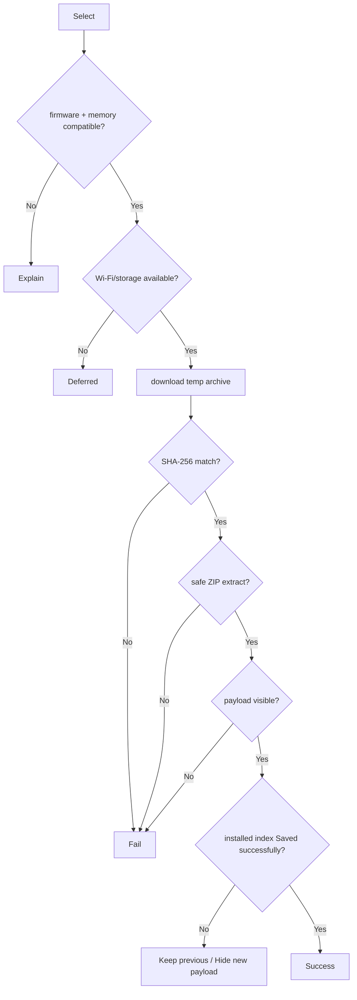

# Activity: Package installation submission

## Questions answered by this picture

How an extension package goes through compatibility, downloading, integrity and secure decompression from candidate metadata, and finally becomes visible to the system with the payload consistent with the installed index.

## Pre-validation

Check firmware version, target capabilities, memory/storage budget, package format and dependencies before network and storage side effects. Compatibility failures are deterministic rejections and do not enter the Deferred download loop.

## Download and decompression boundaries

The archive is downloaded to a temporary location and verified with SHA-256 upon completion. The decompression must reject absolute paths, `..` traversals, symlink escapes, single file/total size exceedance, and number of entries exceedance. If it fails, the temporary content will be deleted and the previous installed version will not be touched.

## Atomic visibility

The existence of the payload file does not mean that the installation is successful. The system first prepares the isolated new payload, verifies runtime visibility, and then atomically submits the installed index. When index saving fails, hide/delete the new payload or restore the previous, so that the query end will always see only the consistent version.

## Resources and Recovery

Package uses Wi-Fi Lease and storage owner; cancellation, revocation, and exception release them. Clean up temporary directories without index references on restart, leaving previous intact. Uninstall also updates the visibility first, and then performs reversible cleanup.

## test
