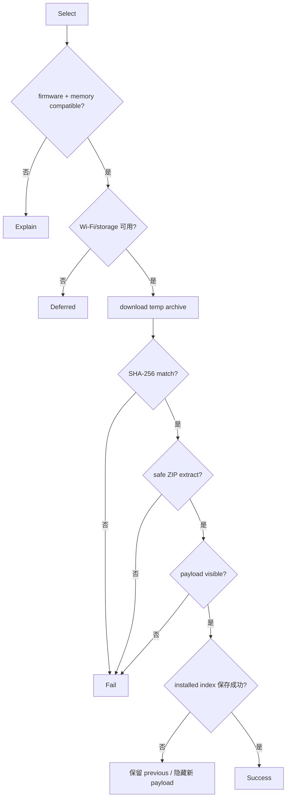

# Activity：Package 安装提交

## 本图回答的问题

一个扩展包如何从候选元数据经过兼容性、下载、完整性和安全解压，最终以 payload 与 installed index 一致的方式对系统可见。

## 前置验证

在网络和存储副作用前检查固件版本、目标能力、内存/存储预算、包格式和依赖。兼容性失败是确定性拒绝，不进入 Deferred 下载循环。

## 下载与解压边界

归档下载到临时位置，完成后以 SHA-256 校验。解压必须拒绝绝对路径、`..` 穿越、符号链接逃逸、单文件/总尺寸超限和条目数量超限。失败时删除本次临时内容，不触碰上一已安装版本。

## 原子可见性

payload 文件存在不等于安装成功。系统先准备隔离的新 payload，验证运行时可见性，再原子提交 installed index。Index 保存失败时隐藏/删除新 payload 或恢复 previous，使查询端永远只看到一致版本。

## 资源与恢复

Package 使用 Wi-Fi Lease 和 storage owner；取消、撤销和异常都释放它们。重启时清理没有 index 引用的临时目录，并保留完整 previous。卸载也先更新可见性，再做可恢复清理。

## 测试

覆盖不兼容、断点/短下载、hash 错误、ZIP traversal、空间耗尽、payload 验证失败、index 保存失败和重启清理。
