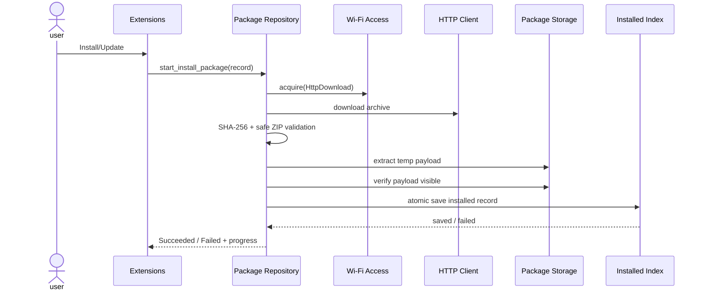

# Sequence: Extensions to Installed Index

## Scenarios and responsibilities

UI only submits package record; Repository orchestrates compatibility and installation transactions; Access provides network lease; HTTP downloads temporary archives; Package Storage manages isolation payload; Installed Index is the submission point for visible versions.

## Sequence constraints

Compatibility check and resource budget are completed before acquire/download. Decompression is allowed only after the download is completed and SHA-256 is verified. Safe ZIP verification and actual extract use the same normalized path rules to avoid "check passing, escape while writing".

## Submit and rollback

After Store verifies that the payload is readable, Index atomically saves the installed record. Succeeded is issued only if Index succeeds. Restore the previous index in case of failure and ensure that new payloads are not discovered; temporary cleanup failure is used as a maintenance diagnosis and does not change the business results.

## Cancel and retry

Cancellation invalidates the download/extract generation and releases the Lease. Retries can reuse explicitly verified caches, but not incomplete archives. Update retains previous until a new version is submitted to avoid intermediate windows with no available extensions.

## Testing

Covering Lease rejection, short download, hash error, path traversal, payload invisible, Index failure, late callback cancellation and previous recovery.
