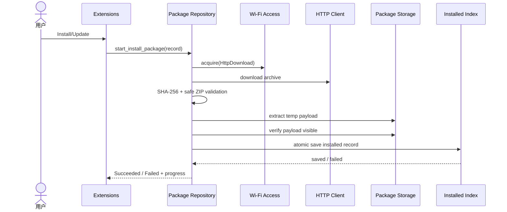

# Sequence：Extensions 到 Installed Index

## 场景与责任

UI 只提交 package record；Repository 编排兼容性和安装事务；Access 提供网络 lease；HTTP 下载临时归档；Package Storage 管理隔离 payload；Installed Index 是可见版本的提交点。

## 顺序约束

兼容性检查和资源预算在 acquire/download 前完成。下载结束并验证 SHA-256 后才允许解压。Safe ZIP 验证与实际 extract 使用同一规范化路径规则，避免“检查通过、写入时逃逸”。

## 提交与回滚

Store 验证 payload 可读后，Index 原子保存 installed record。只有 Index 成功才发布 Succeeded。失败时恢复 previous index，并确保新 payload 不被发现；临时清理失败作为维护诊断，不改变业务结果。

## 取消与重试

取消使 download/extract generation 失效并释放 Lease。重试可复用经过明确校验的缓存，但不能复用不完整归档。Update 保留 previous 直到新版本提交，避免中间窗口没有可用扩展。

## 测试

覆盖 Lease 拒绝、短下载、hash 错误、路径穿越、payload 不可见、Index 失败、取消迟到 callback 和 previous 恢复。
