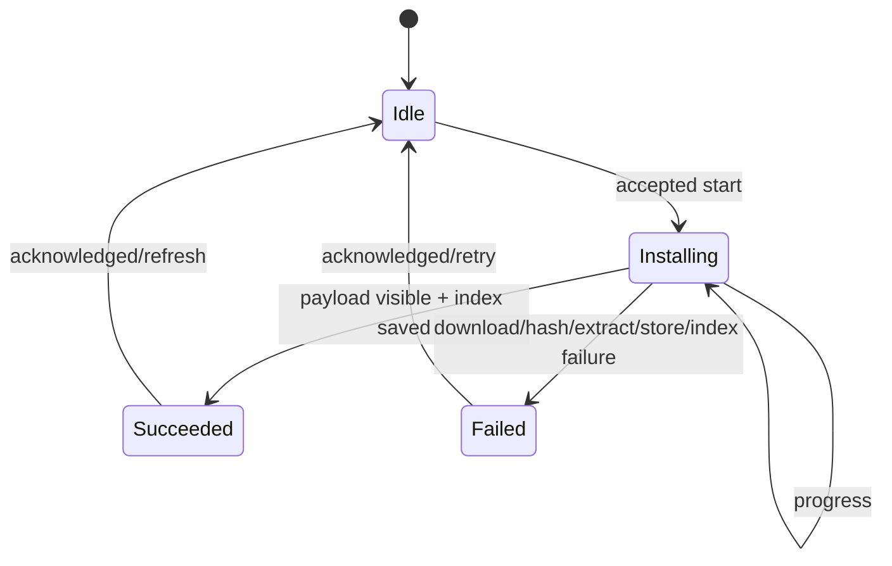

# State Machine:Package Install Status

## Status owner

Package Repository/Installer holds one operation generation and Install Status; UI only subscribes. Installed Index and payload are persistent facts, and Installing/Progress is the running state.

## Successful guard

Succeeded needs to meet the following requirements at the same time: compatibility is still valid, the archive hash is correct, safe decompression is completed, the payload is visible, and the Installed Index atomic save is successful. Succeeded cannot be advanced if the download is 100% or if the file exists.

## Failure classification

Failed saving phase, stable error code and whether to retry. Network Deferred/Cancellation, Integrity Failure, Security Policy Deny, Out of Space, and Index Commit Failure have different recovery actions. A failed transition performs temporary cleanup/previous recovery.

## Concurrency and idempotence

Only one Installing generation is allowed for the same package; other install/update/uninstall commands are busy or queued. Late progress only matches the current generation. Acknowledged only cleans the UI operation and does not delete the successful installation fact.

## Recovery and testing

Determine the visible version based on the Index when restarting, and clean up the orphaned temporary payload. Tests cover every failure phase, previous version retention, repeated start, cancellation and late callbacks.
