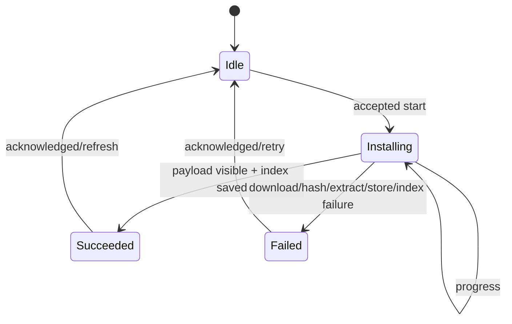

# State Machine：Package Install Status

## 状态 owner

Package Repository/Installer 持有一次 operation generation 和 Install Status；UI 只订阅。Installed Index 与 payload 是持久事实，Installing/进度是运行态。

## 成功 guard

Succeeded 需要同时满足：兼容性仍有效、归档 hash 正确、安全解压完成、payload 可见、Installed Index 原子保存成功。下载 100% 或文件存在都不能提前进入 Succeeded。

## 失败分类

Failed 保存阶段、稳定错误码和是否可重试。网络 Deferred/取消、完整性失败、安全策略拒绝、空间不足和 Index 提交失败具有不同恢复动作。失败 transition 执行临时清理/previous 恢复。

## 并发与幂等

同一 package 只允许一个 Installing generation；其他 install/update/uninstall 命令 Busy 或排队。迟到 progress 只匹配当前 generation。Acknowledged 只清理 UI operation，不删除成功安装事实。

## 恢复与测试

重启时根据 Index 决定可见版本，清理孤立临时 payload。测试覆盖每个失败阶段、previous 版本保留、重复 start、取消和迟到 callback。
