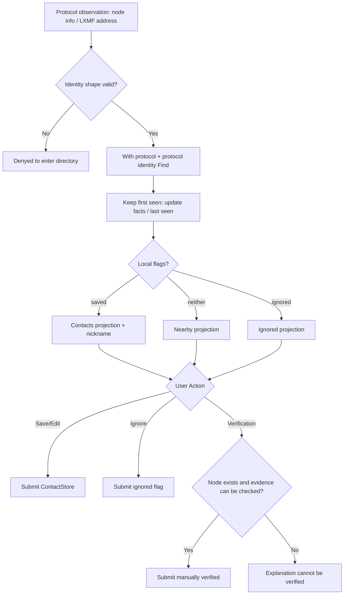

# Activity Diagram: local contact from protocol observation

## Questions answered by this picture

Protocol Broadcast or Reticulum How an address becomes a manageable local directory record, and exactly which layer of facts is changed when a user saves, ignores, renames, or manually verifies it. It is not responsible for guessing peers of different protocols as the same person.

## Identity key and projection

The directory key consists of `protocol namespace + protocol identity`. Meshtastic NodeId, MeshCore identity and Reticulum destination hash cannot be merged due to similar names. The protocol observes updates `lastSeen` and mutable facts while retaining the first observation time; Contacts, Nearby, and Ignored are local relationship projections, not three independent peers.

## Branching and invariants

| Branching | Rules that must be maintained |
| --- | --- |
| Invalid identity shape | Do not create empty records, do not pollute the contact store |
| New observation | Create protocol-scoped key and `firstSeen` |
| Repeat observation | Update facts and `lastSeen`, must not override local nickname/flags |
| Save contact | Establish local nickname relationship, do not change protocol identity |
| Ignore | Hide from default Nearby/Contacts view, but keep revocable records |
| Manual verification | Node must already exist; only write local certification flag |
| removeNode | Delete local record; future legal observations are allowed to reappear |

## Failure and recovery

When persistence fails, the UI continues to display the original submission status and returns a retryable error; you cannot delete optimistically first and then lose the failure information. Nearby's time filtering must use a testable clock; the current implementation has a problem where the visibility policy is not actually enforced and cannot be written as solved in the diagram.

## Source code evidence

`ContactService`, `IMeshPeerDirectory`, `NodeStore / ContactStore` and each platform `reticulum_directory_runtime.cpp` constitute the current owner. Cross-protocol `IdentityLink` does not yet exist, so human verification, Reticulum trusted and Mesh verified keys remain with different attestation semantics.
