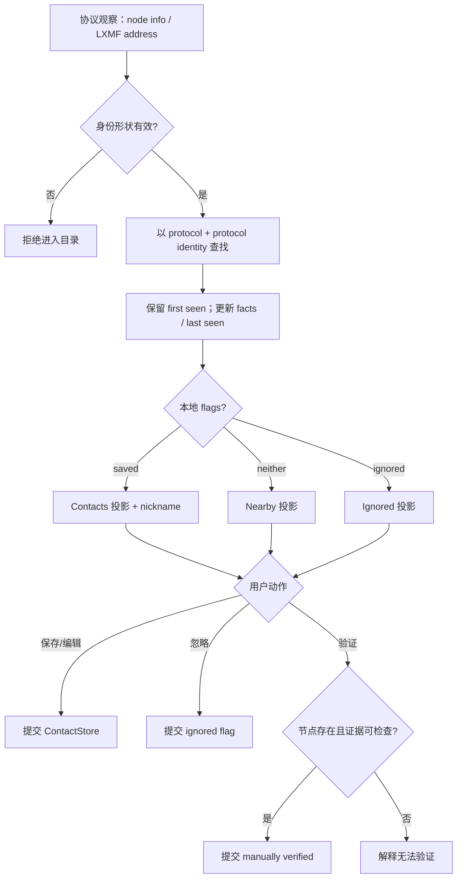

# Activity Diagram：从协议观察到本地联系人

## 本图回答的问题

协议广播或 Reticulum 地址如何成为可管理的本地目录记录，以及用户保存、忽略、重命名或人工验证时究竟改变哪一层事实。它不负责把不同协议的 peer 猜测成同一个人。

## 身份键与投影

目录键由 `protocol namespace + protocol identity` 构成。Meshtastic NodeId、MeshCore identity 与 Reticulum destination hash 不能因为名称相似而合并。协议观察更新 `lastSeen` 和可变事实，同时保留首次观察时间；Contacts、Nearby、Ignored 是本地关系投影，不是三份独立 peer。

## 分支与不变量

| 分支 | 必须保持的规则 |
| --- | --- |
| 无效身份形状 | 不建立空记录，不污染联系人存储 |
| 新观察 | 建立 protocol-scoped key 和 `firstSeen` |
| 重复观察 | 更新事实和 `lastSeen`，不得覆盖本地 nickname/flags |
| 保存联系人 | 建立本地 nickname 关系，不改变协议身份 |
| 忽略 | 从默认 Nearby/Contacts 视图隐藏，但保留可撤销记录 |
| 人工验证 | 节点必须已存在；只写本地证明 flag |
| removeNode | 删除本地记录；未来合法观察允许重新出现 |

## 失败与恢复

持久化失败时 UI 继续显示原提交状态，并返回可重试错误；不能先乐观删除后丢失失败信息。Nearby 的时间过滤必须使用可测试时钟；当前实现存在可见性策略未真正执行的问题，不能在图中写成已解决。

## 源码证据

`ContactService`、`IMeshPeerDirectory`、`NodeStore / ContactStore` 以及各平台 `reticulum_directory_runtime.cpp` 构成当前 owner。跨协议 `IdentityLink` 尚不存在，因此人工验证、Reticulum trusted 和 Mesh verified key 保持为不同证明语义。
