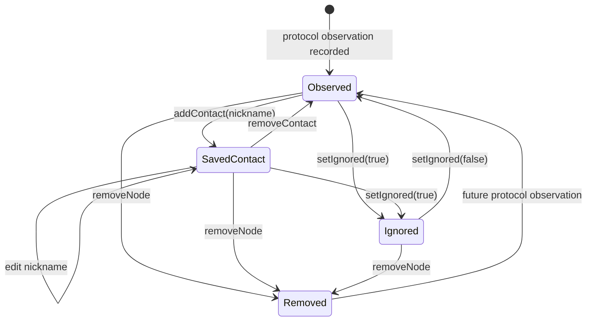

# State Machine：目录条目的本地关系状态

此状态机只描述用户在本机赋予目录条目的关系；协议观察是否在线、密钥是否被协议验证是正交维度。

`manuallyVerified` 是附加 flag，不应伪造成上述单一状态；它要求节点存在，但当前尚未与跨协议 IdentityLink 闭合。

## 状态 owner 与持久化

该状态由本地目录/联系人存储持有，而不是 radio backend。`Observed` 表示有协议事实但没有保存或忽略关系；`SavedContact` 表示存在用户赋予的 nickname 关系；`Ignored` 表示用户明确排除默认投影；`Removed` 是本地删除后的逻辑终点，未来新观察可以重新建立记录。

## Transition 表

| 当前状态 | 事件与 guard | 动作 | 下一状态 |
| --- | --- | --- | --- |
| Observed | `addContact(nickname)`，nickname 合法 | 持久化本地关系 | SavedContact |
| Observed / SavedContact | `setIgnored(true)` | 保留协议事实，设置 ignored | Ignored |
| Ignored | `setIgnored(false)` | 清除 ignored | Observed |
| SavedContact | `editContact` | 更新 nickname，不改变状态 | SavedContact |
| 任意活动状态 | `removeNode` | 删除本地目录及关系 | Removed |
| Removed | 新的合法协议观察 | 建立新 revision | Observed |

## 正交维度

在线/离线、协议密钥是否验证、Reticulum trusted、`manuallyVerified` 都不是上述状态的子状态。把它们塞进一个枚举会产生组合爆炸并混淆证明来源。人工验证必须记录证明语义，未来应通过显式 `IdentityLink` 关联业务联系人。

## 禁止与恢复

- 不允许在节点不存在时直接进入 SavedContact 或 manually verified。
- Ignored 不等于删除；协议事实仍可更新，但默认视图不可泄漏。
- Removed 后的迟到旧事件不得复活旧 revision；只有新的有效观察才可重新进入 Observed。
- 持久化失败保持原状态，不能仅回滚 UI 文案。

## 测试

状态机测试需要覆盖每条合法 transition、所有禁止 transition、重复命令的幂等性，以及 remove 与后台 observation 竞争时的 revision 规则。
