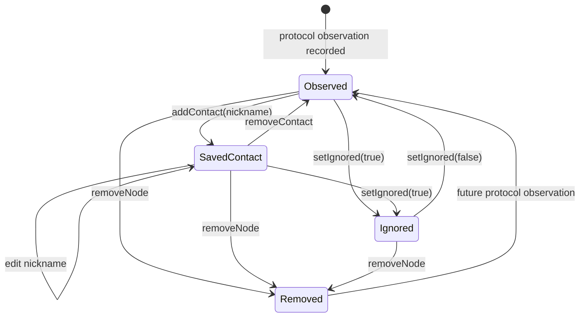

# State Machine: Local relationship status of directory entries

This state machine only describes the relationship assigned to directory entries by users on this machine; whether the protocol is online and whether the key is verified by the protocol are orthogonal dimensions.

`manuallyVerified` is an additional flag and should not be faked into the single state above; it requires that the node exists but is not currently closed with a cross-protocol IdentityLink.

## State owner and persistence

This state is held by the local directory/contact store, not the radio backend. `Observed` means that there is an agreement fact but no saved or ignored relationship; `SavedContact` means that there is a nickname relationship given by the user; `Ignored` means that the user explicitly excludes the default projection; `Removed` is the logical end point after local deletion, and new observations can re-establish the record in the future.

## Transition table

| Current state | Events and guards | Actions | Next state |
| --- | --- | --- | --- |
| Observed | `addContact(nickname)`, nickname is valid | Persist local relationships | SavedContact |
| Observed / SavedContact | `setIgnored(true)` | Preserve protocol facts, set ignored | Ignored |
| Ignored | `setIgnored(false)` | Clear ignored | Observed |
| SavedContact | `editContact` | Update nickname, do not change state | SavedContact |
| Any active state | `removeNode` | Delete local directory and relationship | Removed |
| Removed | New legal protocol observation | Create new revision | Observed |

## Orthogonal dimensions

Online/offline, whether the protocol key is verified, Reticulum trusted, `manuallyVerified` are not sub-states of the above state. Cramming them into an enum creates a combinatorial explosion and obfuscates the source of the proof. Human verification must document attestation semantics and should in the future be associated with business contacts via an explicit `IdentityLink`.

## Ban and restore

 - Direct entry into SavedContact or manually verified is not allowed when the node does not exist.
- Ignored does not equal deletion; protocol facts can still be updated, but the default view cannot be leaked.
- Late old events after Removed may not resurrect old revisions; only new valid observations may re-enter Observed.
- If persistence fails, the original state will be retained, and only the UI copy cannot be rolled back.

## test

State machine testing needs to cover every legal transition, all prohibited transitions, idempotence of repeated commands, and revision rules when remove competes with background observations.
