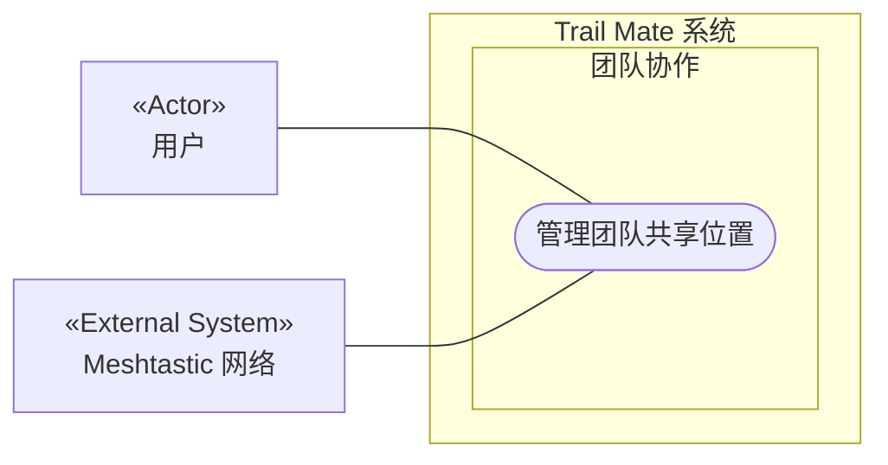

# 用例图：管理团队共享位置

<!-- praxis:use-case-diagram:start -->

## 元数据

项目版本：0.1.30-alpha
设计文档版本：0.1.30-alpha
Git 分支：main
Git 提交：34aad0bffa2f6450192f655f248a94b6c3cbd767
Git 工作区状态：dirty
Agent 版本决策：none - 本次渲染没有单独的 agent 版本决策
更新于：2026-06-25T14:17:55.307Z
来源：Agent 候选分析
所属地图：../use-case-diagrams-maps.md
语义 HTML：manage-team-sharing.html

## 身份信息

- ID：use-case:manage-team-sharing
- 业务边界路径：Trail Mate 系统 / 团队协作
- 当前边界类型：业务模块
- 当前边界职责：支持多个用户组成团队并共享实时位置
- 状态：candidate
- 置信度：low
- Markdown 路径：docs/design/use-case-diagrams/manage-team-sharing.md
- HTML 路径：docs/design/use-case-diagrams/manage-team-sharing.html
- 触发条件：用户进入团队管理界面

## 故事摘要

用户创建或加入团队，与团队成员共享实时位置

## 参与者

- 用户（个人）

## 外部系统

- Meshtastic 网络

## UML 下钻地图

- Use Case Diagram：[管理团队共享位置](manage-team-sharing.html)
  - Activity Diagram：[业务流程：管理团队共享](manage-team-sharing/activity.html)
  - Sequence Diagram：[对象交互：管理团队共享](manage-team-sharing/sequences/sequence-manage-team-sharing.html)

## Mermaid 用例图



## 设计指标索引

此章节是 Design Explorer 可解析的指标索引。每个数字都必须能回溯到这里的具体条目，避免 UI 只展示不可解释的计数。

| 指标 | 数量 | 内容边界 |
| --- | ---: | --- |
| 节点 | 5 | 参与者、外部系统、上下文和当前用例。 |
| 关系 | 8 | 当前用例与上下文、参与者、外部系统或其他用例之间的关系。 |
| 证据 | 2 | 支撑当前候选用例的文件、代码证据、规范或推断证据。 |
| 待裁决 | 0 | 仍需产品或业务负责人裁决的外部问题。 |

### 节点

- Trail Mate 系统（业务边界：系统边界） - 管理整个应用的用户目标和业务能力
- 团队协作（业务边界：业务模块） - 支持多个用户组成团队并共享实时位置
- 管理团队共享位置（用例） - 用户创建或加入团队，与团队成员共享实时位置
- 用户（参与者） - 使用 Trail Mate 设备的最终用户，可以查看状态、收发消息、配置设备、使用诊断工具
- Meshtastic 网络（外部系统） - 基于 LoRa 的 Mesh 通信网络，用于传输消息和位置信息

### 关系

- Trail Mate 系统 包含业务边界「团队协作」（包含关系）
- 团队协作 包含 Use Case「管理团队共享位置」（包含关系）
- 用户 作为主要参与者参与「管理团队共享位置」（参与关系） - 使用 Trail Mate 设备的最终用户，可以查看状态、收发消息、配置设备、使用诊断工具
- Meshtastic 网络 参与「管理团队共享位置」（外部协作） - 基于 LoRa 的 Mesh 通信网络，用于传输消息和位置信息
- 用户 -> 管理团队共享位置（参与关系） - 用户管理团队
- Meshtastic 网络 -> 管理团队共享位置（参与关系） - 网络传输位置数据
- 用户 -> 管理团队共享位置（参与关系） - 用户管理团队共享
- Meshtastic 网络 -> 管理团队共享位置（参与关系） - 网络传输位置数据

### 证据

- 证据 1 · 本地仓库扫描 · apps/esp32_lvgl/src/esp32_lvgl_idf_app_facade_runtime.cpp · 524-524（FACT:medium） - ESP32 固件中存在 TeamController

  ```text
  IdfAppFacadeRuntime::getTeamController
  ```
- 证据 2 · 本地仓库扫描 · apps/linux_uconsole_gtk/src/platform/gtk/gtk_uconsole_team_logic.cpp · 1-1（INFERENCE:medium） - 团队管理逻辑

  ```text
  team logic
  ```

### 待裁决

- 无

## 主成功路径

1. 1. 用户打开团队页面
2. 2. 系统获取当前 GPS 位置
3. 3. 系统通过 TeamService 将位置广播到团队频道
4. 4. 其他团队成员的位置在地图上显示
5. 用户选择创建或加入团队
6. 系统通过 Meshtastic 网络发送/接收团队位置数据
7. 系统在地图上渲染团队成员位置
8. 用户创建新团队或加入已有团队
9. 系统通过 Meshtastic 网络广播团队信息
10. 位置数据在团队内共享

## 备选路径

1. 无

## 失败路径

1. 网络不可用时只能查看缓存数据

## 证据

| 来源 | 路径 | 行号 | 强度 | 摘要 |
| --- | --- | --- | --- | --- |
| 本地仓库扫描 | apps/esp32_lvgl/src/esp32_lvgl_idf_app_facade_runtime.cpp | 524-524 | medium | ESP32 固件中存在 TeamController |
| 本地仓库扫描 | apps/linux_uconsole_gtk/src/platform/gtk/gtk_uconsole_team_logic.cpp | 1-1 | medium | 团队管理逻辑 |

## 变更记录

### 0.1.30-alpha - 2026-06-25T14:17:55.307Z

变更类型：DISCOVERY
版本决策：none - 本次渲染没有单独的 agent 版本决策


Git 分支：main
Git 提交：34aad0bffa2f6450192f655f248a94b6c3cbd767
Git 工作区状态：dirty

摘要：
- 恢复或更新候选用例图「管理团队共享位置」。

<!-- praxis:use-case-diagram:end -->
