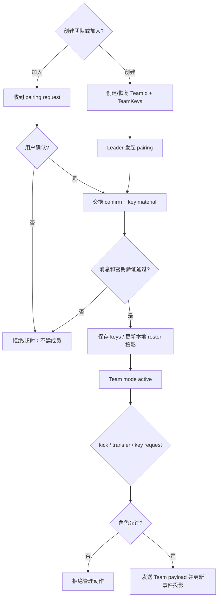

# Activity：配对到成员状态

## 本图回答的问题

设备如何创建或加入团队、交换用途分离的密钥，并执行 kick、leader transfer 和 key request 等管理动作。本文确认配对行为；完整 TeamMember 生命周期仍是 candidate。

## 身份、角色与密钥

TeamId、leader/member pairing role、pairing state 和不同用途的 TeamKeys 是当前明确事实。协议 NodeId 可以参与传输，但不能自动成为稳定 TeamMemberId。每种密钥用途和版本必须保留，禁止把一段共享 secret 同时解释为所有能力。

## 配对提交

用户确认、远端 confirm、消息验证、key material 验证和本地持久化缺一不可。收到 pairing request 不创建成员；发送 confirm 也不表示双方都已提交。只有持久化成功后才能进入 Team mode active。

## 管理动作授权

kick、leader transfer 和 key distribution 必须检查当前角色、目标成员、团队 revision/密钥版本和消息认证。UI 是否显示按钮不是授权来源。拒绝必须说明角色不足、目标不存在、密钥过期或传输不可用。

## 缺失设计

当前 roster 主要是 `vector<NodeId>`，没有成员资格来源、角色生命周期、revision、撤销证明或跨协议 IdentityLink。因此“成员已加入/已被移除”的冲突合并与重放规则尚未闭合。

## 测试

覆盖用户拒绝、confirm 超时、密钥验证失败、持久化失败、重复 pairing、非 leader 管理命令、leader transfer 竞争和旧 key request。
