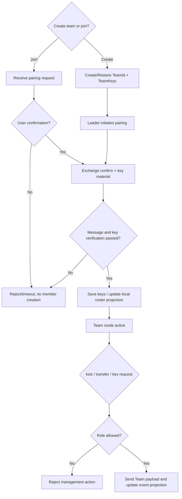

# Activity: Pair to member status

## Questions answered by this picture

How devices create or join teams, exchange purpose-separated keys, and perform management actions such as kicks, leader transfers, and key requests. This article confirms pairing behavior; the full TeamMember lifecycle is still a candidate.

## Identities, roles and keys

TeamId, leader/member pairing role, pairing state and different purposes of TeamKeys are currently clear facts. A protocol NodeId can participate in the transport but cannot automatically become a stable TeamMemberId. Each key use and version must be preserved, and it is prohibited to interpret a shared secret to all capabilities simultaneously.

## Pairing submission

User confirmation, remote confirm, message verification, key material verification and local persistence are all indispensable. Receiving a pairing request does not create a member; sending confirm does not mean that both parties have submitted. Team mode active can only be entered after persistence is successful.

## Management Action Authorization

Kick, leader transfer and key distribution must check the current role, target member, team revision/key version and message authentication. Whether the UI displays the button or not is not a source of authorization. The rejection must indicate insufficient roles, target non-existence, key expiration, or transport unavailability.

## Missing Design

The current roster is primarily a `vector<NodeId>`, with no membership source, role lifecycle, revision, revocation proof or cross-protocol IdentityLink. Therefore, the conflict merging and replay rules of "Member Joined/Removed" have not yet been closed.

## Tests

 Covers user rejection, confirm timeout, key verification failure, persistence failure, duplicate pairing, non-leader management commands, leader transfer competition and old key request.
