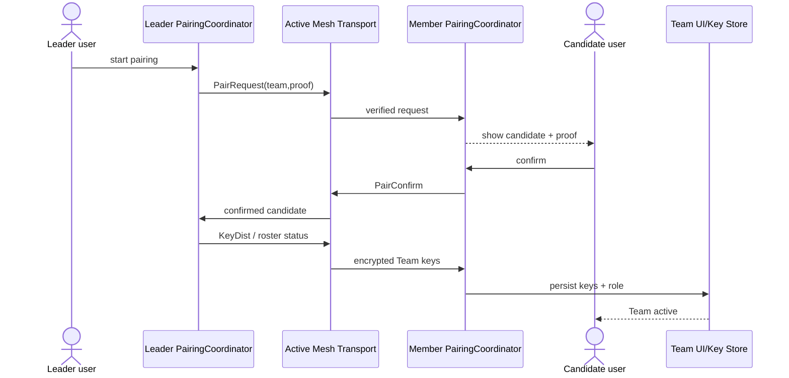

# Sequence: Leader and Candidate pairing

## Scenarios and responsibilities

Leader/Member PairingCoordinator each has a local pairing phase; Transport only carries verified messages; Candidate user confirms joining intention; Key Store is the persistence boundary of local TeamId, keys and role.

## Sequence and Authentication

PairRequest must bring team and leader proof; Member will only accept confirmation after displaying verifiable information. PairConfirm is associated with the original request nonce/session. KeyDist is only sent to confirmed candidates and uses the appropriate protection context. The plain text of the team shared key cannot be put into ordinary broadcast.

## Submission semantics

Leader receiving confirm does not mean that Member is active. Members can only enter Team active after key material verification and Store submission are successful. The Leader's roster projection of when members are added requires independent ACK/revision; the current implementation is still incomplete for this.

## Repeat, timeout and revocation

Repeat request/confirm/keyDist by pairing session idempotent. Timeout clears temporary key material and does not create members. After leader cancellation or candidate rejection, late messages cannot restore the session. Old key versions cannot overwrite new team status.

## test
