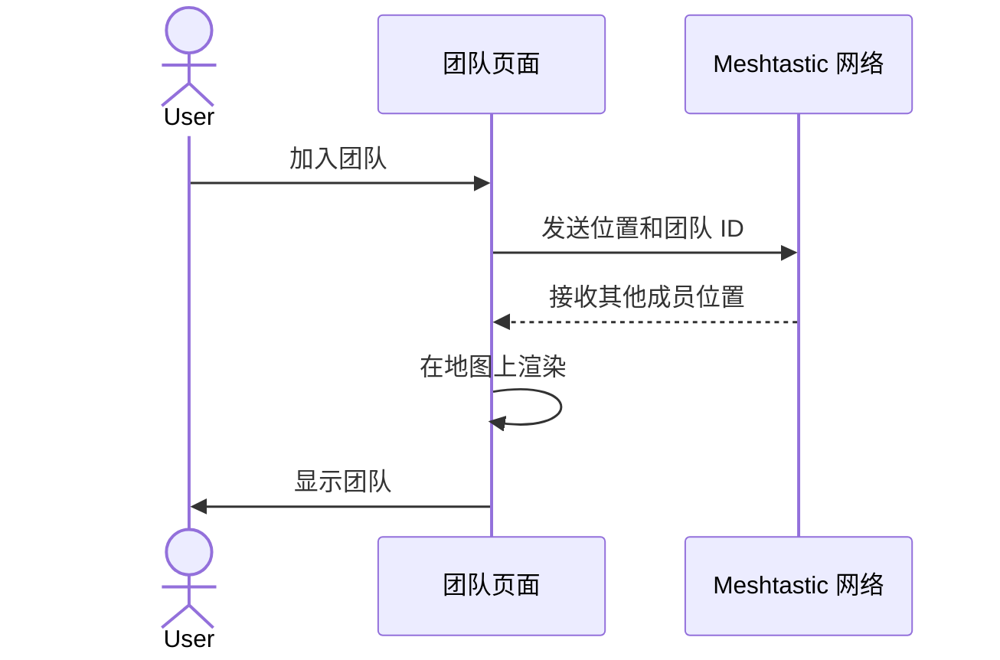

# Sequence Diagram：对象交互：管理团队共享

<!-- praxis:use-case-diagram:start -->

## 元数据

项目版本：0.1.30-alpha
设计文档版本：0.1.30-alpha
Git 分支：main
Git 提交：34aad0bffa2f6450192f655f248a94b6c3cbd767
Git 工作区状态：dirty
Agent 版本决策：none - 本次渲染没有单独的 agent 版本决策
更新于：2026-06-25T14:17:55.307Z
来源：Agent 候选分析
父级 Use Case：use-case:manage-team-sharing
业务边界路径：Trail Mate 系统 / 团队协作
父级文档：docs/design/use-case-diagrams/manage-team-sharing.md
Markdown 路径：docs/design/use-case-diagrams/manage-team-sharing/sequences/sequence-manage-team-sharing.md
HTML 路径：docs/design/use-case-diagrams/manage-team-sharing/sequences/sequence-manage-team-sharing.html

## 交互场景

团队协作

## 参与者 / 生命线

- actor User
- participant UI as 团队页面
- participant Network as Meshtastic 网络

## 消息时序

- User->>UI: 加入团队
- UI->>Network: 发送位置和团队 ID
- Network-->>UI: 接收其他成员位置
- UI->>UI: 在地图上渲染
- UI->>User: 显示团队

## 同步 / 异步 / 回调

- Network-->>UI: 接收其他成员位置

## 返回 / 异常 / 补偿

- Network-->>UI: 接收其他成员位置

## 事务 / 幂等 / 重试边界

网络同步

- 无

## Sequence UML 读图说明

交互

## 实现范围锚点

- 模块：apps/linux_uconsole_gtk
- 模块：boards
- 代码锚点：apps/linux_uconsole_gtk/src/platform/gtk/gtk_uconsole_team_logic.cpp#L1
- 不覆盖代码：非当前场景的全部调用链
- 不覆盖代码：未被证据支持的异步/补偿路径

## 不覆盖场景

- 所有相关函数调用
- 所有失败补偿场景
- 未被证据支持的异步或回调流程

## Mermaid 图

## 证据上下文

| 来源 | 路径 | 行号 | 强度 | 摘要 |
| --- | --- | --- | --- | --- |
| 本地仓库扫描 | apps/esp32_lvgl/src/esp32_lvgl_idf_app_facade_runtime.cpp | 524-524 | medium | ESP32 固件中存在 TeamController |
| 本地仓库扫描 | apps/linux_uconsole_gtk/src/platform/gtk/gtk_uconsole_team_logic.cpp | 1-1 | medium | 团队管理逻辑 |

## 变更记录

### 0.1.30-alpha - 2026-06-25T14:17:55.307Z

变更类型：DISCOVERY
版本决策：none - 本次渲染没有单独的 agent 版本决策

Git 分支：main
Git 提交：34aad0bffa2f6450192f655f248a94b6c3cbd767
Git 工作区状态：dirty

摘要：
- 恢复或更新「管理团队共享位置」的 Sequence Diagram。

<!-- praxis:use-case-diagram:end -->
