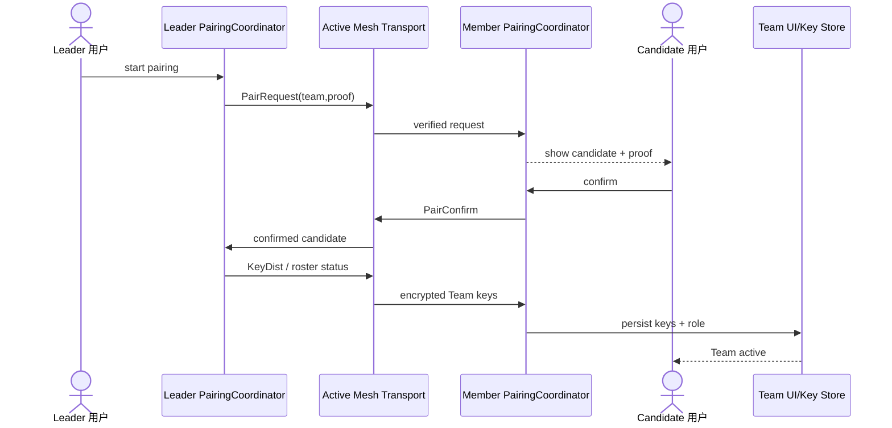

# Sequence：Leader 与 Candidate 配对

## 场景与责任

Leader/Member PairingCoordinator 各自拥有本地 pairing phase；Transport 只承载已验证消息；Candidate 用户确认加入意图；Key Store 是本地 TeamId、keys 和 role 的持久化边界。

## 顺序与认证

PairRequest 必须带团队和 leader proof；Member 展示可验证信息后才接受确认。PairConfirm 关联原 request nonce/session。KeyDist 只发给已确认 candidate，并使用适合的保护上下文，不能把团队共享 key 明文放入普通广播。

## 提交语义

Leader 收到 confirm 不等于 Member 已 active。Member 只有在 key material 验证和 Store 提交成功后进入 Team active。Leader 的 roster 投影何时加入成员需要独立 ACK/revision；当前实现对此仍不完整。

## 重复、超时与撤销

重复 request/confirm/keyDist 按 pairing session 幂等。超时清除临时 key material，不创建成员。Leader 取消或 candidate 拒绝后，迟到消息不能恢复 session。旧 key version 不能覆盖新团队状态。

## 测试

覆盖伪造 proof、用户拒绝、confirm 丢失、重复 KeyDist、Store 失败、两次并发 pairing 和 leader/member 状态不一致。
