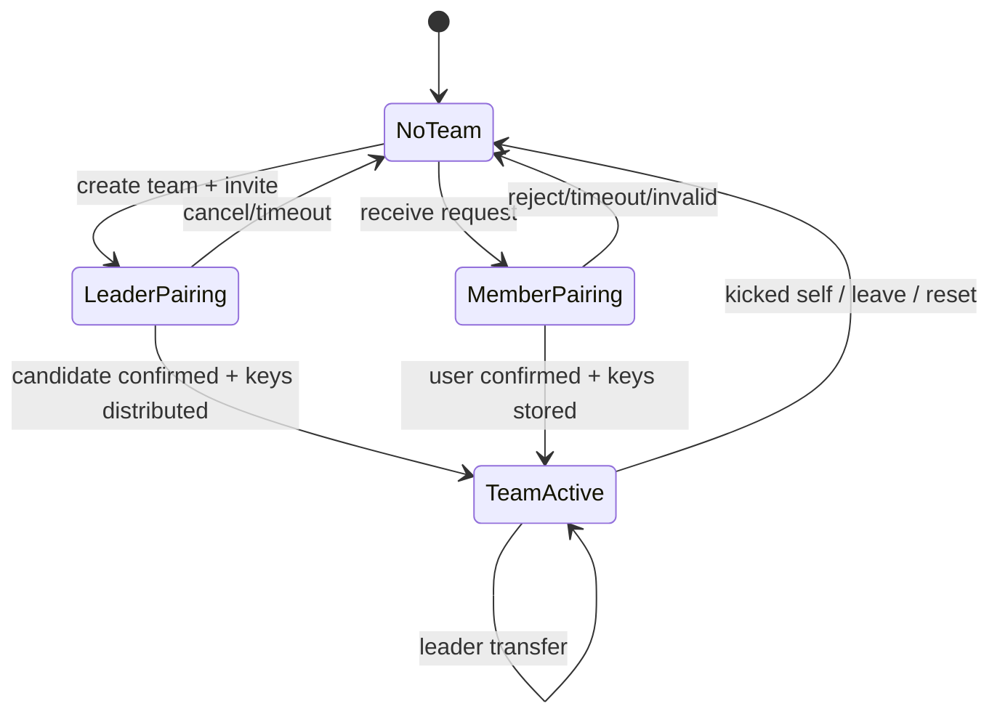

# State Machine: Pairing and local member projections

`TeamActive` is the current local projection and does not mean that the code already has a complete, revised TeamMember aggregate.

## Current state owner

PairingCoordinator holds the temporary pairing stage, Key Store/Team UI projection holds whether the machine already has TeamId, role and valid keys. Since there is no complete TeamMember aggregate, this state machine only describes the native team pattern and does not express a consistent member list for the entire team.

## Transition and guard

| Current state | Event/guard | Submit | Next state |
| --- | --- | --- | --- |
| NoTeam | create + keys valid | save leader role/team keys | LeaderPairing |
| NoTeam | verified request | Save temporary pairing session | MemberPairing |
| LeaderPairing | confirm + KeyDist accepted | local roster projection | TeamActive |
| MemberPairing | User confirmation + keys stored | Save member role/team keys | TeamActive |
| Pairing | cancel/timeout/invalid | Clean up temporary key material | NoTeam |
| TeamActive | self kicked/leave/reset | Revoke local keys and roles | NoTeam |

## Questions that cannot be answered by this picture

Whether a remote member has been persisted, the global revision of leader transfer, the conflict between kick and offline devices, and the stable mapping of membership identities across protocols have not closed the owner. These remain in the Review Queue and TeamActive cannot be written as a consensus of the whole team.

## Replay and idempotent

pairing session nonce, TeamId and key version together to identify the message. Old KeyDist, duplicate confirm, and old leader transfer must not revert to native state. NoTeam keys are not automatically restored after late management messages.

## Testing

 Covers status inconsistencies between both parties, timeouts, old keys, duplicate messages, self being kicked, reset and leader transfer competition.
