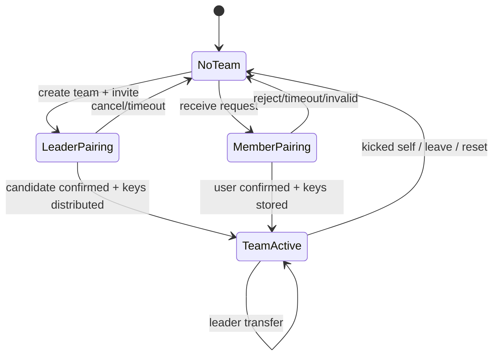

# State Machine：Pairing 与本地成员投影

`TeamActive` 是当前本地投影，不代表代码已经拥有完整、revisioned 的 TeamMember 聚合。

## 当前状态 owner

PairingCoordinator 持有临时配对阶段，Key Store/Team UI 投影持有本机是否已具备 TeamId、role 和有效 keys。由于没有完整 TeamMember aggregate，本状态机只描述本机团队模式，不表达整个团队的一致成员列表。

## Transition 与 guard

| 当前状态 | 事件/guard | 提交 | 下一状态 |
| --- | --- | --- | --- |
| NoTeam | create + keys valid | 保存 leader role/team keys | LeaderPairing |
| NoTeam | verified request | 保存临时 pairing session | MemberPairing |
| LeaderPairing | confirm + KeyDist accepted | 本地 roster 投影 | TeamActive |
| MemberPairing | 用户确认 + keys stored | 保存 member role/team keys | TeamActive |
| Pairing | cancel/timeout/invalid | 清理临时 key material | NoTeam |
| TeamActive | self kicked/leave/reset | 撤销本地 keys 和 role | NoTeam |

## 不能由本图回答的问题

远端某成员是否已持久化、leader transfer 的全局 revision、kick 与离线设备冲突、成员身份跨协议稳定映射均没有闭合 owner。这些留在 Review Queue，不能把 TeamActive 写成全团队共识。

## 重放与幂等

pairing session nonce、TeamId 和 key version 共同识别消息。旧 KeyDist、重复 confirm 和旧 leader transfer 不得倒退本机状态。NoTeam 后迟到管理消息不自动恢复 keys。

## 测试

覆盖双方状态不一致、超时、旧 key、重复消息、自我被 kick、reset 和 leader transfer 竞争。
