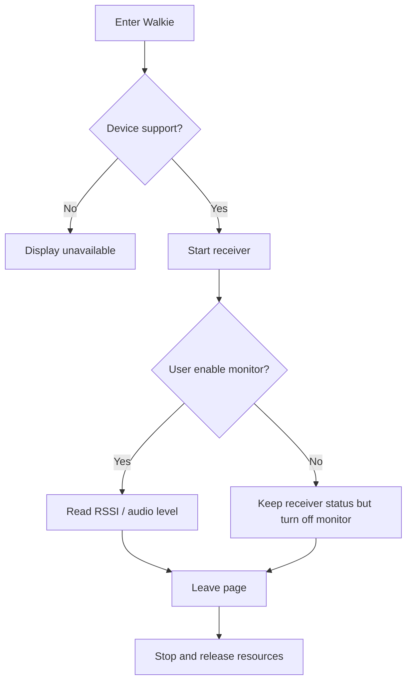

# Activity:Walkie Monitor

## Questions answered by this picture

How does a device with analog reception capabilities enter listening, switch monitors, and ensure that radio/audio resources are released correctly when leaving the page or when the capabilities are not met. The current implementation only acknowledges reception monitoring and does not fabricate PTT transmissions.

## Capabilities and preconditions

When entering the page, first read the target board capabilities, radio availability and current resource owner. Unsupported devices show a stable unavailable reason and the receiver is not created. Only after supporting and successfully obtaining resources can it enter the listening state.

## Monitor semantics

`receiver started` and `monitor enabled` are two facts: the former indicates that the receiving hardware has been configured, and the latter determines whether to continuously sample/play RSSI and audio level. Turning off a monitor should not implicitly become a PTT, nor should it change the channel configuration undefined.

## Exit and failure

The page leaves, resources are preempted by high-priority functions, radio errors and audio output failures all enter a unified stop. stop must be idempotent and only releases resources acquired by this session according to ownership. The UI must not retain the "listening" projection on failed startup.

## Data update rules

RSSI and audio level are short-life cycle measurement values ​​and should be limited to frequency projections; missing samples are displayed as unknown instead of using expired signals. Monitor loops must not perform unbounded reads on the UI thread.

## Source code and testing

Evidence comes from Walkie page runtime, board level capability gating and receiver/radio owner. Test coverage does not support device, startup failure, monitor on/off, preemption, page exit and repeated stop.
