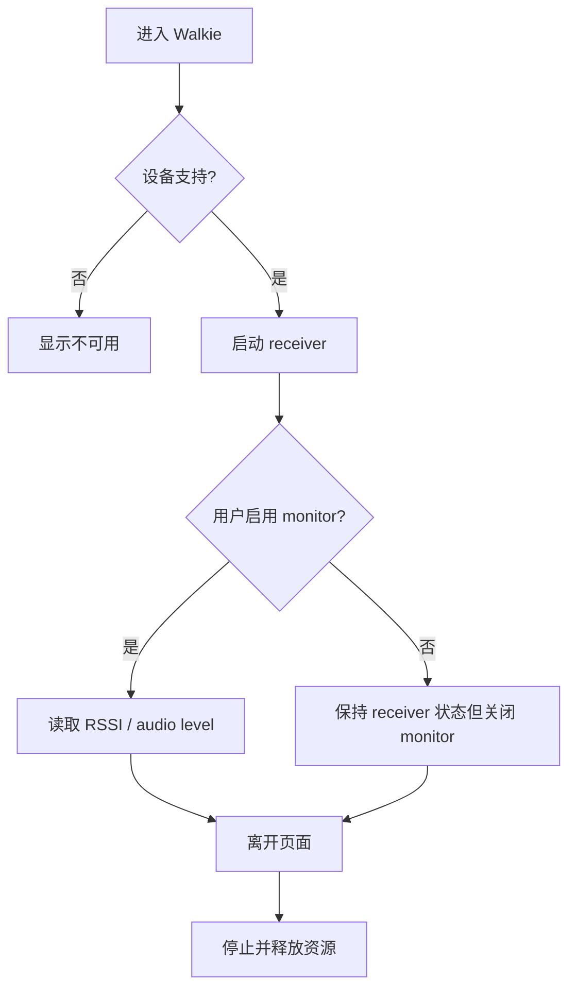

# Activity：Walkie Monitor

## 本图回答的问题

具备模拟接收能力的设备如何进入监听、切换 monitor，并保证离开页面或能力不满足时 radio/音频资源被正确释放。当前实现只确认接收监控，不虚构 PTT 发射。

## 能力与前置条件

页面进入时先读取目标板能力、radio 可用性和当前资源 owner。不支持的设备显示稳定的 unavailable 原因，不创建 receiver。支持并成功取得资源后才能进入监听状态。

## Monitor 语义

`receiver started` 与 `monitor enabled` 是两个事实：前者表示接收硬件已配置，后者决定是否持续采样/播放 RSSI 和 audio level。关闭 monitor 不应隐式变成 PTT，也不应未经定义地改变频道配置。

## 退出与失败

页面离开、资源被高优先级功能抢占、radio 错误和音频输出失败都进入统一 stop。stop 必须幂等，并按所有权只释放本次会话取得的资源。启动失败时 UI 不得保留“正在监听”投影。

## 数据更新规则

RSSI 与 audio level 是短生命周期测量值，应限频投影；缺样本显示未知，而不是沿用过期信号。监控循环不得在 UI 线程执行无界读取。

## 源码与测试

证据来自 Walkie 页面 runtime、板级 capability gating 和 receiver/radio owner。测试覆盖不支持设备、启动失败、monitor on/off、抢占、页面退出和重复 stop。
