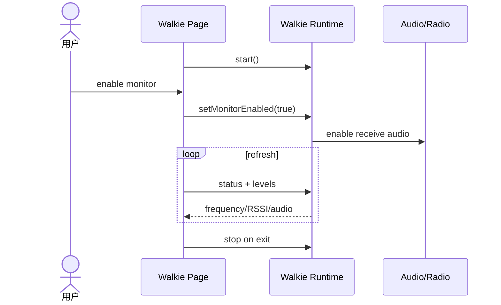

# Sequence：Walkie Monitor

## 场景与责任

Walkie Page 发送生命周期命令并显示快照；Runtime 拥有 receiver session 和 monitor flag；Audio/Radio 拥有硬件。用户启用 monitor 只改变接收音频/测量，不产生发射命令。

## 启动顺序

图中省略的 capability 与 acquire 必须发生在 Runtime `start()` 内并先于硬件配置。start 失败返回不可用/忙原因，UI 不继续调用 monitor enable。

## 刷新与新鲜度

status/levels 是有界频率的快照。每个快照带 session generation 和采样时间；迟到响应不能更新已退出或重新进入的页面。无新样本显示 unknown，而不是重复旧 RSSI。

## 停止与抢占

页面退出、radio 抢占和硬件失败都调用同一 stop。stop 先停止刷新和音频，再释放 receiver/radio；重复 stop 安全。抢占后 UI 显示停止原因，不自动重新 acquire 形成争抢循环。

## 测试

覆盖 capability 不支持、start 失败、enable/disable、刷新迟到、抢占和 exit/stop 幂等。
