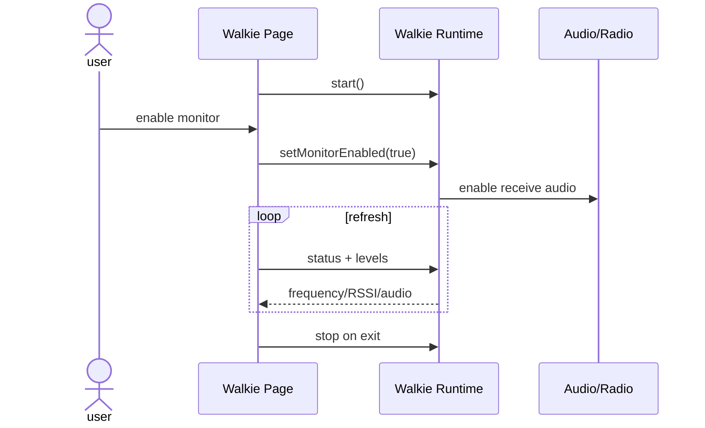

# Sequence:Walkie Monitor

## Scenarios and responsibilities

Walkie Page sends life cycle commands and displays snapshots; Runtime owns receiver session and monitor flag; Audio/Radio owns hardware. User enabled monitor only changes receive audio/measurements and does not generate transmit commands.

## Startup sequence

The capabilities and acquires omitted in the figure must occur within Runtime `start()` and precede hardware configuration. If start fails, the reason is returned as unavailable/busy, and the UI does not continue to call monitor enable.

## Refresh and freshness

status/levels are snapshots of bounded frequencies. Each snapshot comes with a session generation and sampling time; late responses cannot update exited or re-entered pages. No new samples show unknown instead of repeating the old RSSI.

## Stop and preemption

The same stop is called for page exit, radio preemption and hardware failure. stop stops refresh and audio first, then releases receiver/radio; repeat stop for safety. After preemption, the UI displays the reason for the stop and does not automatically re-acquire, forming a contention loop.

## Testing

Cover capability is not supported, start fails, enable/disable, refresh is late, preemption and exit/stop are idempotent.
