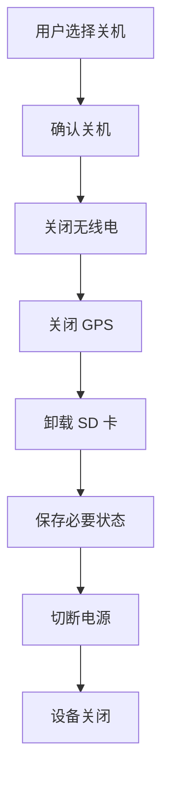

# Activity Diagram：业务流程：关闭设备电源

<!-- praxis:use-case-diagram:start -->

## 元数据

项目版本：0.1.30-alpha
设计文档版本：0.1.30-alpha
Git 分支：main
Git 提交：34aad0bffa2f6450192f655f248a94b6c3cbd767
Git 工作区状态：dirty
Agent 版本决策：none - 本次渲染没有单独的 agent 版本决策
更新于：2026-06-25T14:17:55.307Z
来源：Agent 候选分析
父级 Use Case：use-case:power-off-device
业务边界路径：Trail Mate 系统 / 设备管理
父级文档：docs/design/use-case-diagrams/power-off-device.md
Markdown 路径：docs/design/use-case-diagrams/power-off-device/activity.md
HTML 路径：docs/design/use-case-diagrams/power-off-device/activity.html

## 业务流程目标

用户准备关机时系统执行安全关闭序列

## 流程边界

从用户触发关机到电源关闭

## 参与泳道 / 阶段

- 未显式声明泳道；请结合节点标签和实现范围判断业务阶段。

## 主成功路径

关机流程

- mainSuccessScenario[1]
- mainSuccessScenario[2]
- mainSuccessScenario[3]

## 决策点与分支

- 无

## 失败 / 补偿路径

- 无

## 流程业务规则

Board 封装所有硬件关闭操作

## Activity UML 读图说明

顺序执行关闭步骤

## 实现范围锚点

- 模块：boards
- 关键文件：boards/tlora_pager/src/tlora_pager_board.cpp
- 代码锚点：boards/tlora_pager/src/tlora_pager_board.cpp#L1
- 不覆盖代码：底层函数调用链
- 不覆盖代码：DTO/Mapper/Repository 细节

## 不覆盖范围

- 强制关机
- 低电量自动关机

## Mermaid 图

## 证据上下文

| 来源 | 路径 | 行号 | 强度 | 摘要 |
| --- | --- | --- | --- | --- |
| 本地仓库扫描 | boards/tlora_pager/src/tlora_pager_board.cpp | 1-1 | strong | 关机逻辑 |
| 本地仓库扫描 | boards/tlora_pager/src/tlora_pager_board.cpp | 1-1 | strong | 关机相关方法 |

## 变更记录

### 0.1.30-alpha - 2026-06-25T14:17:55.307Z

变更类型：DISCOVERY
版本决策：none - 本次渲染没有单独的 agent 版本决策

Git 分支：main
Git 提交：34aad0bffa2f6450192f655f248a94b6c3cbd767
Git 工作区状态：dirty

摘要：
- 恢复或更新「关闭设备电源」的 Activity Diagram。

<!-- praxis:use-case-diagram:end -->
