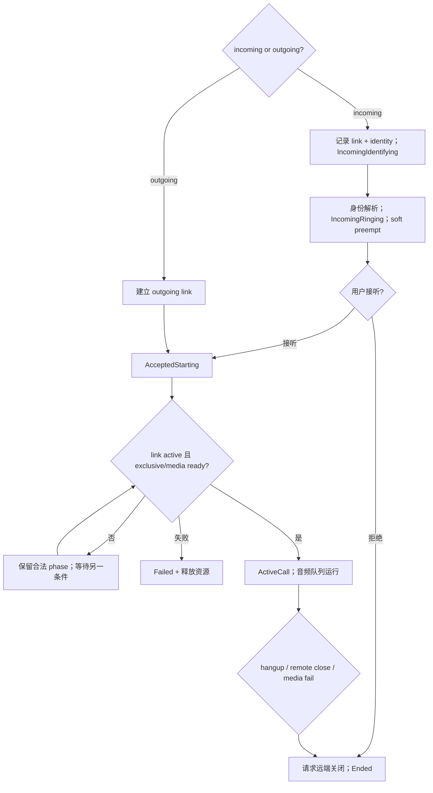

# Activity Diagram：来电与去电汇合

## 本图回答的问题

来电和去电如何汇合到同一个 CallSession，以及 link active、用户接受和媒体资源就绪以不同顺序到达时，系统如何避免提前进入通话或重复关闭。

## 阶段责任

IncomingIdentifying 只拥有 link 和待解析 identity；IncomingRinging 允许软抢占并等待用户决定；AcceptedStarting 表示用户意图成立，但仍需 link active 和独占媒体资源；ActiveCall 才允许音频队列工作。Ended/Failed 都必须收束远端 link、Wi-Fi/radio lease 和音频设备。

## 汇合条件

`link active` 与 `accept` 是两个可乱序事件。状态机保存两者的事实，并在 guard `accepted && linkActive && exclusiveMediaReady` 成立时只进入一次 ActiveCall。任何一个条件暂未满足都留在合法等待阶段，不用轮询伪造下一状态。

## 资源抢占

响铃阶段只申请 soft preempt，避免尚未接听就永久阻塞其他功能。用户接受后升级为 Call 独占；升级失败应进入可解释失败并释放软资源。ActiveCall 期间高带宽后台任务必须遵守 CallExclusive Decision。

## 终止与幂等

本地 hangup、远端 close、link failure 和 media failure 都调用同一 close path。重复 close、迟到 accept 或迟到 link active 不得重新激活已终结 session。终止先阻止新媒体帧，再关闭队列和 link，最后发布终态。

## 测试

使用事件排列测试覆盖：accept 先到、link active 先到、响铃时远端关闭、接听时独占失败、ActiveCall 媒体失败，以及多次 hangup/close 的幂等性。
