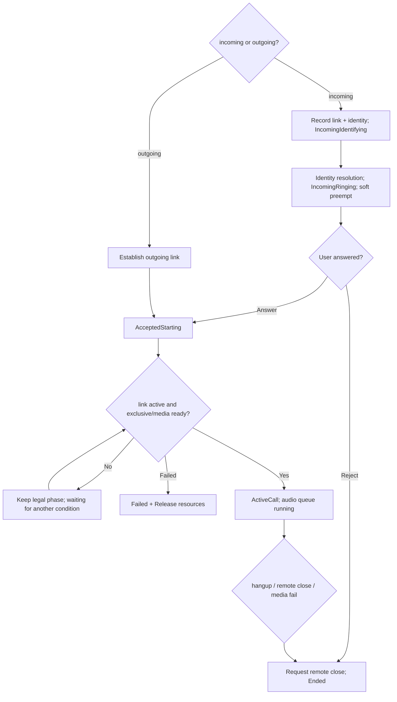

# Activity Diagram: Convergence of incoming and outgoing calls

## Questions answered by this picture

How incoming and outgoing calls are merged into the same CallSession, and how the system avoids entering the call early or closing repeatedly when link active, user accepted, and media resource ready arrive in different orders.

## Stage Responsibilities

IncomingIdentifying only has link and identity to be resolved; IncomingRinging allows soft preemption and waits for user decision; AcceptedStarting indicates that the user intention is established, but link active and exclusive media resources are still required; ActiveCall allows the audio queue to work. Ended/Failed must contain the remote link, Wi-Fi/radio lease and audio device.

## Convergence conditions

`link active` and `accept` are two events that can be ordered out of order. The state machine saves the facts of both and only enters ActiveCall once when guard `accepted && linkActive && exclusiveMediaReady` is established. If any condition is not met yet, it will remain in the legal waiting stage without polling to forge the next state.

## Resource preemption

Only apply for soft preempt during the ringing phase to avoid permanently blocking other functions before answering. After the user accepts it, it is upgraded to Call exclusive; if the upgrade fails, it should enter an explainable failure and release the soft resources. High-bandwidth background tasks must respect the CallExclusive Decision during ActiveCall.

## Termination and idempotence

Local hangup, remote close, link failure and media failure all call the same close path. Repeated close, late accept, or late link active must not reactivate a terminated session. Termination first blocks new media frames, then closes the queue and link, and finally publishes the final state.

## test

Use event arrangement to test coverage: accept comes first, link active comes first, remote shutdown when ringing, exclusive failure when answering, ActiveCall media failure, and idempotence of multiple hangup/close.
