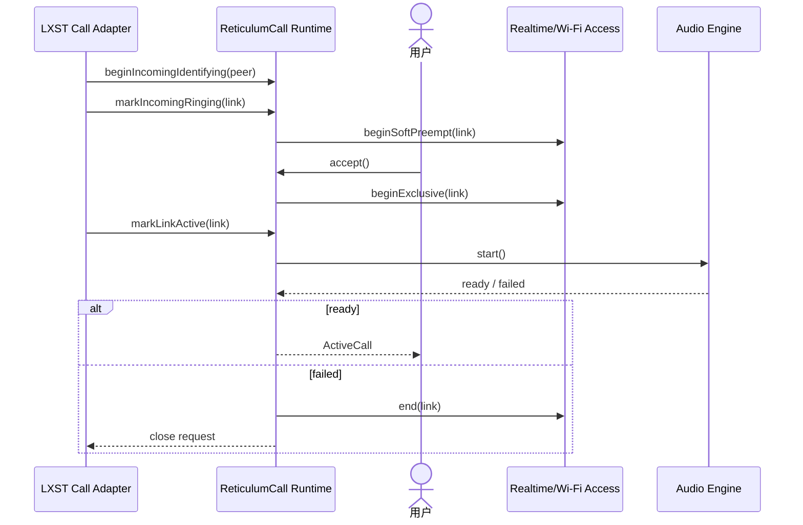

# Sequence Diagram：接听与资源独占

## 场景与参与者

LXST Adapter 拥有 link 回调，Call Runtime 拥有 session phase，用户提供 accept 意图，Access Runtime 裁决 soft/exclusive 资源，Audio Engine 只报告媒体启动结果。任何 adapter 回调都不能直接把 UI 设为 ActiveCall。

## 允许的事件乱序

`accept()` 与 `markLinkActive()` 可交换顺序。Call Runtime 分别记录 accepted 和 linkActive，在 exclusive 资源与 Media ready 都满足时只完成一次汇合。相同 link 的重复回调幂等；其他 link/generation 的迟到回调被拒绝。

## 资源升级

Ringing 先 `beginSoftPreempt`；accept 后 `beginExclusive`。独占失败时不启动 Media，并结束 soft preempt。Media ready 是最后 guard，不能因为 link active 就打开音频队列。

## 关闭顺序

失败或 hangup 先使 session 不再接受媒体帧，再停止 Audio、释放 Access，最后请求 link close。Close request 和远端 close 可以竞争，统一由幂等终止路径收束。

## 测试

排列 accept/linkActive/mediaReady 三个事件，覆盖独占失败、媒体失败、远端提前关闭、多 link 和重复 close。
