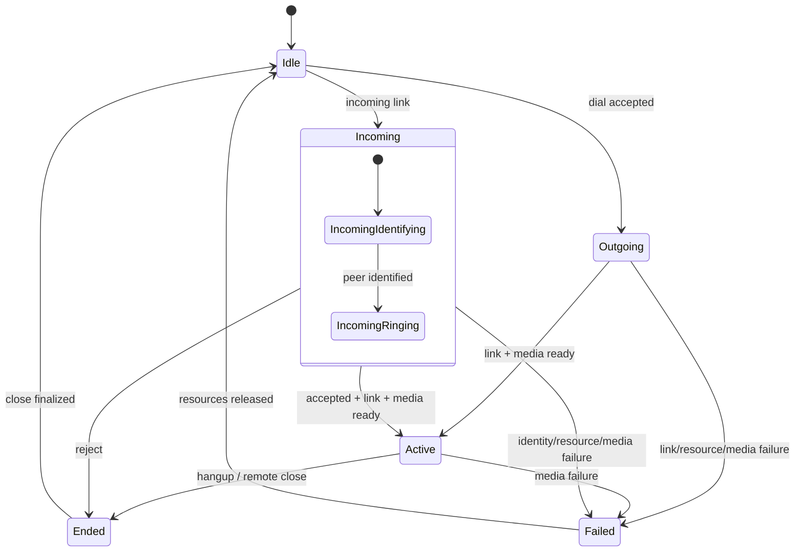

# State Machine: Call State and RealtimePhase

Implements the RealtimePhase of `AcceptedStarting / ActiveCall / ClosingCall`; it refines the resource stage and does not replace the outer user-visible State.

## Status owner

Call Runtime holds outer user state and internal RealtimePhase in call/link generation. UI can only project, LXST/link callback can only submit events. Resource owner, Media Engine and remote link do not each maintain a "current call state".

## Key transition

| Current state | event/guard | action | next state |
| --- | --- | --- | --- |
| Idle | incoming link | Save generation, start identity | Incoming |
| Incoming | accept and link/media/exclusively ready | Start media projection | Active |
| Incoming | reject/remote close | Close link, release soft preempt | Ended |
| Outgoing | link/media/exclusively ready | Start media | Active |
| Active | hangup/remote close | Block new frames and close resources | Ended |
| Any active state | Unrecoverable resource/media failure | Record the reason and close | Failed |

## Orthogonal RealtimePhase

`IncomingIdentifying`, `IncomingRinging`, `AcceptedStarting`, `ActiveCall`, `ClosingCall` express resource and media preparation details. They cannot replace the outer State, otherwise the UI will mistakenly display "User accepted but media not ready" as Active.

## Prohibited and idempotent

Accept, linkActive and mediaReady after Ended/Failed are all invalid; callbacks of different generations do not match the current session. close finalized and resource release allow repeated calls, but only release the final state once.

## Recovery and testing

The call status will not be restored across device restarts; any remaining sessions at startup will be returned to Idle and platform resources will be cleaned up. The test covers all legal transitions, out-of-order rendezvous, late final state events and resource release failures.
