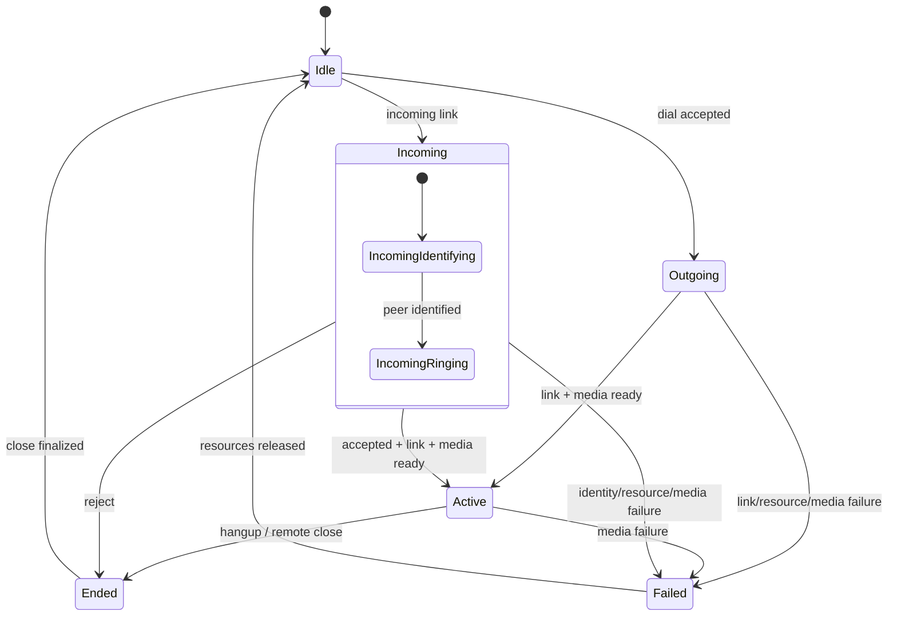

# State Machine：Call State 与 RealtimePhase

实现还有 `AcceptedStarting / ActiveCall / ClosingCall` 的 RealtimePhase；它细化资源阶段，不替代外层用户可见 State。

## 状态 owner

Call Runtime 以 call/link generation 持有外层用户状态和内部 RealtimePhase。UI 只能投影，LXST/link callback 只能提交事件。资源 owner、Media Engine 和远端 link 不各自维护一份“当前通话状态”。

## 关键 transition

| 当前状态 | 事件/guard | 动作 | 下一状态 |
| --- | --- | --- | --- |
| Idle | incoming link | 保存 generation，开始 identity | Incoming |
| Incoming | accept 且 link/media/独占就绪 | 启动媒体投影 | Active |
| Incoming | reject/remote close | 关闭 link、释放 soft preempt | Ended |
| Outgoing | link/media/独占就绪 | 启动媒体 | Active |
| Active | hangup/remote close | 阻止新帧，收束资源 | Ended |
| 任意活动态 |不可恢复资源/媒体失败 | 记录原因并关闭 | Failed |

## 正交的 RealtimePhase

`IncomingIdentifying`、`IncomingRinging`、`AcceptedStarting`、`ActiveCall`、`ClosingCall` 表达资源与媒体准备细节。它们不能代替外层 State，否则 UI 会把“用户已接受但媒体未就绪”误显示为 Active。

## 禁止与幂等

Ended/Failed 后的 accept、linkActive 和 mediaReady 全部无效；不同 generation 的回调不匹配当前 session。close finalized 和资源 release 允许重复调用，但只发布一次终态。

## 恢复与测试

通话状态不跨设备重启恢复；启动时任何残留 session 归 Idle，并清理平台资源。测试覆盖所有合法 transition、乱序汇合、终态迟到事件及资源释放失败。
