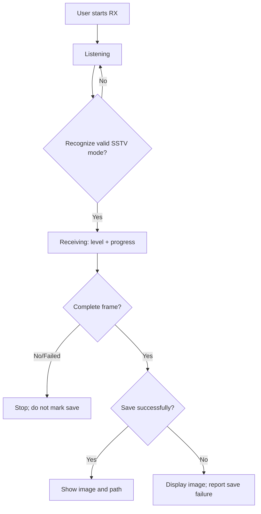

# Activity: SSTV Reception

## Questions answered by this picture

User starts once After SSTV RX, how does the system obtain the complete image from monitoring, pattern recognition and step-by-step decoding, and distinguish between the two results of "image decoded" and "image saved".

## Stage and data ownership

Listening only retains the receiving configuration and signal detection; Receiving has the fixed storage, mode and progress of the current frame; only a complete frame can transfer the image projection and saving port. Large image buffers must use member scratch, fixed slots, or controlled storage and cannot be automatic local objects on the ESP task stack.

## Branching rules

Continue to monitor unrecognized signals without creating failure pictures. A loss of synchronization, size conflict, or verification failure after a pattern has been recognized should terminate the current frame with an explicit error. Only the complete frame can be displayed as Ready; the partial frame must not cover the previous complete image.

## Save semantics

Decoding is completed independently of SD saving. When the save is successful, the stable path is displayed; when the save fails, the complete image in the memory can still be displayed, but "Unsaved" must be displayed, and the path cannot be left as the old value. Filename conflicts, storage busy, and out of space require different errors.

## Cancel and resume

Stop receiving and releasing radios when the user cancels or the page exits, and invalidates late progress/frame-ready events. Start over to create a new session generation, old session events must not update the new page.

## Source code and testing

The evidence comes from the SSTV page receiving runtime, decoding progress/frame-ready events and save path callbacks. The test covers noise, pattern recognition failure, partial frame, save failure, late event on exit and two consecutive receptions.
