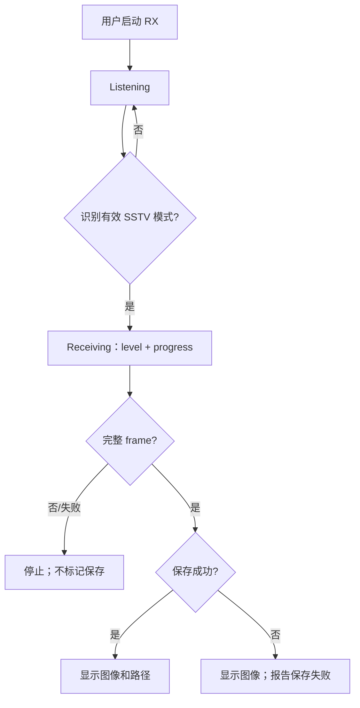

# Activity：SSTV 接收

## 本图回答的问题

用户启动一次 SSTV RX 后，系统如何从监听、模式识别和逐步解码得到完整图像，并区分“图像已解码”和“图像已保存”两个结果。

## 阶段与数据所有权

Listening 只保留接收配置和信号检测；Receiving 拥有当前帧的固定存储、模式和进度；完整 frame 才能转交图像投影与保存端口。大图像缓冲区必须使用成员 scratch、固定槽或受控存储，不能成为 ESP 任务栈上的自动局部对象。

## 分支规则

无法识别的信号继续监听，不制造失败图片。已识别模式后出现同步丢失、尺寸冲突或校验失败，应终止当前帧并保留明确错误。只有完整 frame 可以显示为 Ready；partial frame 不得覆盖上一张完整图像。

## 保存语义

解码完成与 SD 保存独立。保存成功时展示稳定路径；保存失败时仍可展示内存中的完整图像，但必须显示“未保存”，不能把路径留成旧值。文件名冲突、存储忙和空间不足需要不同错误。

## 取消与恢复

用户取消或页面退出时停止接收、释放 radio，并使迟到的 progress/frame-ready 事件失效。重新开始创建新 session generation，旧 session 事件不得更新新页面。

## 源码与测试

证据来自 SSTV 页面接收 runtime、解码进度/frame-ready 事件和保存路径回调。测试覆盖噪声、模式识别失败、partial frame、保存失败、退出时迟到事件和连续两次接收。
