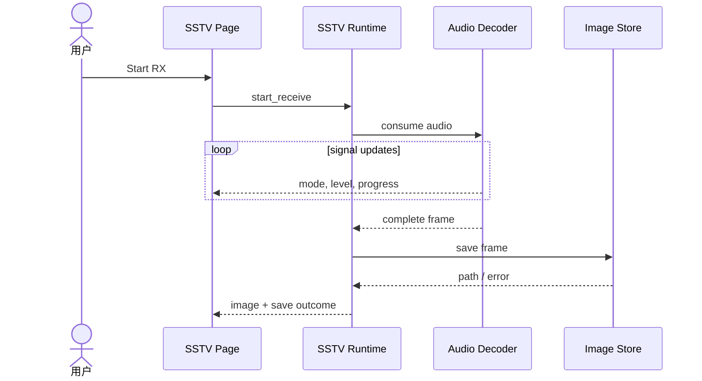

# Sequence：SSTV 解码与保存

## 场景与责任

UI 管理一次 RX session；Runtime 拥有接收生命周期和 frame buffer；Decoder 消费音频并产生模式/进度/完整 frame；Image Store 只负责持久化完整图像。

## 事件顺序

progress 只能在当前 session 且模式已识别时更新。`complete frame` 是保存的前置条件；Runtime 在转交 Store 前冻结 frame ownership，避免 Decoder 立即复用缓冲导致保存内容变化。

## 保存与显示

Store 返回 path 表示文件已经稳定提交。保存错误不否定完整解码，UI 可显示图像但明确标注未保存；只有 path 属于当前 frame 时才显示，不能沿用上次路径。

## 取消、迟到和内存

用户取消或退出递增 session generation，迟到 progress/complete/save callback 全部失效。Frame buffer 使用成员/固定槽或 caller storage，禁止在音频任务栈上构造大图像对象。

## 测试

覆盖 progress 乱序、连续 frame、保存期间下一帧、Store 失败、取消后迟到完成和缓冲复用。
