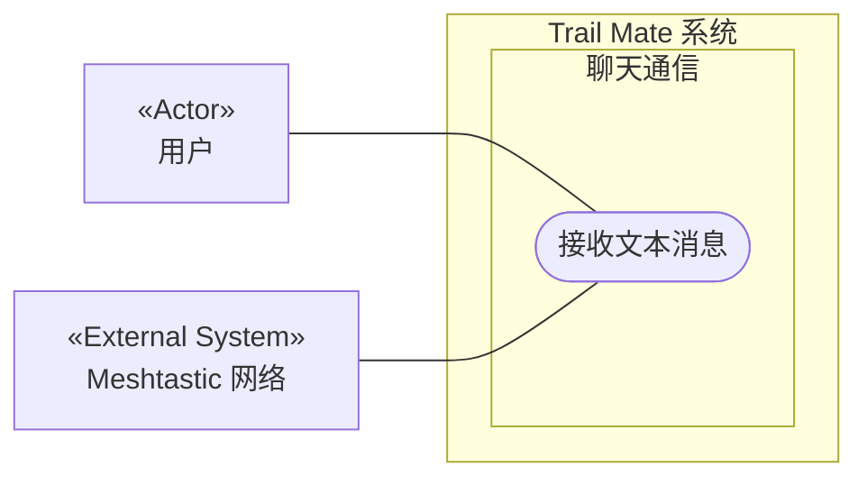

# 用例图：接收文本消息

<!-- praxis:use-case-diagram:start -->

## 元数据

项目版本：0.1.30-alpha
设计文档版本：0.1.30-alpha
Git 分支：main
Git 提交：34aad0bffa2f6450192f655f248a94b6c3cbd767
Git 工作区状态：dirty
Agent 版本决策：none - 本次渲染没有单独的 agent 版本决策
更新于：2026-06-25T14:17:55.307Z
来源：Agent 候选分析
所属地图：../use-case-diagrams-maps.md
语义 HTML：receive-text-message.html

## 身份信息

- ID：use-case:receive-text-message
- 业务边界路径：Trail Mate 系统 / 聊天通信
- 当前边界类型：业务模块
- 当前边界职责：管理用户间的消息传递和无线电链路配置
- 状态：candidate
- 置信度：medium
- Markdown 路径：docs/design/use-case-diagrams/receive-text-message.md
- HTML 路径：docs/design/use-case-diagrams/receive-text-message.html
- 触发条件：无线电接收到消息数据包

## 故事摘要

系统监听无线电信号，接收来自其他节点的文本消息，并将其显示在聊天界面

## 参与者

- 用户（个人）

## 外部系统

- Meshtastic 网络

## UML 下钻地图

- Use Case Diagram：[接收文本消息](receive-text-message.html)
  - Activity Diagram：[业务流程：接收文本消息](receive-text-message/activity.html)
  - Sequence Diagram：[对象交互：接收文本消息](receive-text-message/sequences/sequence-receive-text-message-sequence.html)
  - Class Collaboration Diagram：[类/结构协作：接收文本消息](receive-text-message/realization/class-collaboration.html)

## Mermaid 用例图



## 设计指标索引

此章节是 Design Explorer 可解析的指标索引。每个数字都必须能回溯到这里的具体条目，避免 UI 只展示不可解释的计数。

| 指标 | 数量 | 内容边界 |
| --- | ---: | --- |
| 节点 | 5 | 参与者、外部系统、上下文和当前用例。 |
| 关系 | 8 | 当前用例与上下文、参与者、外部系统或其他用例之间的关系。 |
| 证据 | 2 | 支撑当前候选用例的文件、代码证据、规范或推断证据。 |
| 待裁决 | 0 | 仍需产品或业务负责人裁决的外部问题。 |

### 节点

- Trail Mate 系统（业务边界：系统边界） - 管理整个应用的用户目标和业务能力
- 聊天通信（业务边界：业务模块） - 管理用户间的消息传递和无线电链路配置
- 接收文本消息（用例） - 系统监听无线电信号，接收来自其他节点的文本消息，并将其显示在聊天界面
- 用户（参与者） - 使用 Trail Mate 设备的最终用户，可以查看状态、收发消息、配置设备、使用诊断工具
- Meshtastic 网络（外部系统） - 基于 LoRa 的 Mesh 通信网络，用于传输消息和位置信息

### 关系

- Trail Mate 系统 包含业务边界「聊天通信」（包含关系）
- 聊天通信 包含 Use Case「接收文本消息」（包含关系）
- 用户 作为主要参与者参与「接收文本消息」（参与关系） - 使用 Trail Mate 设备的最终用户，可以查看状态、收发消息、配置设备、使用诊断工具
- Meshtastic 网络 参与「接收文本消息」（外部协作） - 基于 LoRa 的 Mesh 通信网络，用于传输消息和位置信息
- 用户 -> 接收文本消息（参与关系） - 用户接收到消息
- Meshtastic 网络 -> 接收文本消息（参与关系） - 网络传入消息
- 用户 -> 接收文本消息（参与关系） - 用户接收消息
- Meshtastic 网络 -> 接收文本消息（参与关系） - 网络传入消息

### 证据

- 证据 1 · 本地仓库扫描 · boards/tlora_pager/src/tlora_pager_board.cpp · 1-1（FACT:strong） - 接收消息函数

  ```text
  startRadioReceive, readRadioData
  ```
- 证据 2 · 本地仓库扫描 · boards/tlora_pager/src/tlora_pager_board.cpp · 1-1（FACT:strong） - 消息接收和无线电解码相关方法

  ```text
  tlora_pager_board.cpp
  ```

### 待裁决

- 无

## 主成功路径

1. 无线电模块接收到数据包
2. 系统读取数据并解析为文本消息
3. 系统将消息添加到当前聊天窗口，并可能触发通知
4. 无线电模块接收到消息数据包
5. 系统解析数据包并转换为文本
6. 系统将消息推送到 UI 聊天窗口

## 备选路径

1. 无

## 失败路径

1. 数据包解析失败，丢弃或记录错误日志
2. 数据包损坏，丢弃

## 证据

| 来源 | 路径 | 行号 | 强度 | 摘要 |
| --- | --- | --- | --- | --- |
| 本地仓库扫描 | boards/tlora_pager/src/tlora_pager_board.cpp | 1-1 | strong | 接收消息函数 |
| 本地仓库扫描 | boards/tlora_pager/src/tlora_pager_board.cpp | 1-1 | strong | 消息接收和无线电解码相关方法 |

## 变更记录

### 0.1.30-alpha - 2026-06-25T14:17:55.307Z

变更类型：DISCOVERY
版本决策：none - 本次渲染没有单独的 agent 版本决策


Git 分支：main
Git 提交：34aad0bffa2f6450192f655f248a94b6c3cbd767
Git 工作区状态：dirty

摘要：
- 恢复或更新候选用例图「接收文本消息」。

<!-- praxis:use-case-diagram:end -->
