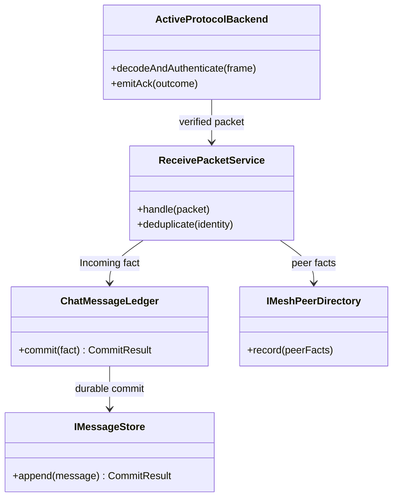

# Class Collaboration: Receive Responsibility Boundary

The protocol backend has wire validation; the Receive service has receiving use cases; the Ledger has message status merging; the Store does not determine the business final state.

## Responsibility allocation

| Collaborator | Owned | Definitely not owned |
| --- | --- | --- |
| ActiveProtocolBackend | framing, target, crypto, protocol ACK | Session unread, business end state |
| ReceivePacketService | Receive orchestration, protocol-scoped dedup, peer/message combination | wire parsing, persistence implementation |
| ChatMessageLedger | Message identity, status partial order, commit result | radio, protocol encoding |
| IMeshPeerDirectory | protocol-scoped peer facts | Business contact cross-protocol identity |
| IMessageStore | durable append/revision | Delivered/Failed business decision |

## Depends on direction

Backend calls the Receive service through the authenticated packet DTO; Receive relies on the Directory and Ledger ports; Ledger relies on the Store port. Store adapter does not call UI or Backend reversely, preventing the infrastructure from determining the business status.

## Data ownership

The life cycle of a large frame terminates at Backend; what is passed across the boundary is a compact packet/commit input with clear ownership. Ledger fact with protocol namespace, message identity and attempt/revision, prohibits sharing of mutable message struct.

## Consistency and Failure

Peer observation and message commit are related but may fail independently. Messages are only published after Durable; Directory failures are retried by policy and retain diagnostics. Store Deferred is taken over by bounded slot and does not block the radio path.

## Test seams

 Can replace Fake Backend, Directory, Ledger/Store to verify respectively: invalid wire does not enter the use case, dedup does not re-submit, final state merge is not determined by the Store, and the ownership of Deferred is safe.
