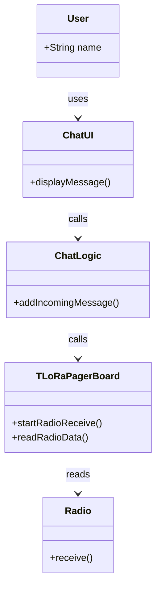

# Class Collaboration Diagram：类/结构协作：接收文本消息

<!-- praxis:use-case-diagram:start -->

## 元数据

项目版本：0.1.30-alpha
设计文档版本：0.1.30-alpha
Git 分支：main
Git 提交：34aad0bffa2f6450192f655f248a94b6c3cbd767
Git 工作区状态：dirty
Agent 版本决策：none - 本次文档质量修正，不触发版本 bump
更新于：2026-06-25T15:56:23.352Z
来源：Agent 重新分析生成
父级 Use Case：use-case:receive-text-message
业务边界路径：Trail Mate 系统 / 聊天通信
父级文档：docs/design/use-case-diagrams/receive-text-message.md
Markdown 路径：docs/design/use-case-diagrams/receive-text-message/realization/class-collaboration.md
HTML 路径：docs/design/use-case-diagrams/receive-text-message/realization/class-collaboration.html

## 协作场景

描述接收文本消息时涉及的主要类/接口及其静态关系。

## 参与者 / 角色

- **User**：最终用户，通过 UI 查看接收到的消息。
- **ChatUI**：GTK 聊天界面，负责显示消息列表。
- **ChatLogic**：聊天逻辑层，处理消息的追加和 UI 更新。
- **TLoRaPagerBoard**：T-LoRa-Pager 板级驱动类，管理无线电接收。
- **Radio**：外部无线电硬件模块。

## 类与接口

- `ChatUI`：GTK 聊天界面类，方法 `displayMessage()`。
- `ChatLogic`：聊天逻辑类，方法 `addIncomingMessage()`。
- `TLoRaPagerBoard`：板级驱动类，继承自 `LilyGo_Display`，包含 `startRadioReceive()` 和 `readRadioData()`。
- `Radio`：外部硬件，事件驱动接收。

## 依赖关系

- User --> ChatUI：调用 UI 操作
- ChatUI --> ChatLogic：委托逻辑处理
- ChatLogic --> TLoRaPagerBoard：调用读取无线电数据
- TLoRaPagerBoard --> Radio：读取数据包

## Class UML 读图说明

展示接收文本消息场景中用户界面、业务逻辑和硬件驱动之间的静态结构关系。

## 实现范围锚点

- 模块：boards
- 模块：apps/linux_uconsole_gtk
- 关键文件：boards/tlora_pager/src/tlora_pager_board.cpp
- 关键文件：apps/linux_uconsole_gtk/src/platform/gtk/gtk_uconsole_chat_logic.cpp
- 代码锚点：boards/tlora_pager/src/tlora_pager_board.cpp#L1335（startRadioReceive）
- 不覆盖代码：底层驱动细节、数据编码/解码细节

## 不覆盖场景

- 消息回调线程安全
- 离线消息处理

## Mermaid 图

## 证据上下文

| 来源 | 路径 | 行号 | 强度 | 摘要 |
| --- | --- | --- | --- | --- |
| 本地仓库扫描 | boards/tlora_pager/src/tlora_pager_board.cpp | 1335-1344 | strong | TLoRaPagerBoard::startRadioReceive |
| 本地仓库扫描 | boards/tlora_pager/src/tlora_pager_board.cpp | 1368-1377 | strong | TLoRaPagerBoard::readRadioData |
| 本地仓库扫描 | apps/linux_uconsole_gtk/src/platform/gtk/gtk_uconsole_chat_logic.cpp | 1 | strong | ChatLogic 消息处理 |

## 变更记录

### 0.1.30-alpha - 2026-06-25T15:56:23.352Z

变更类型：DISCOVERY
版本决策：none - 本次文档质量修正，不触发版本 bump
Git 分支：main
Git 提交：34aad0bffa2f6450192f655f248a94b6c3cbd767
Git 工作区状态：dirty

摘要：
- 创建接收文本消息的 Class Collaboration 图。

<!-- praxis:use-case-diagram:end -->
