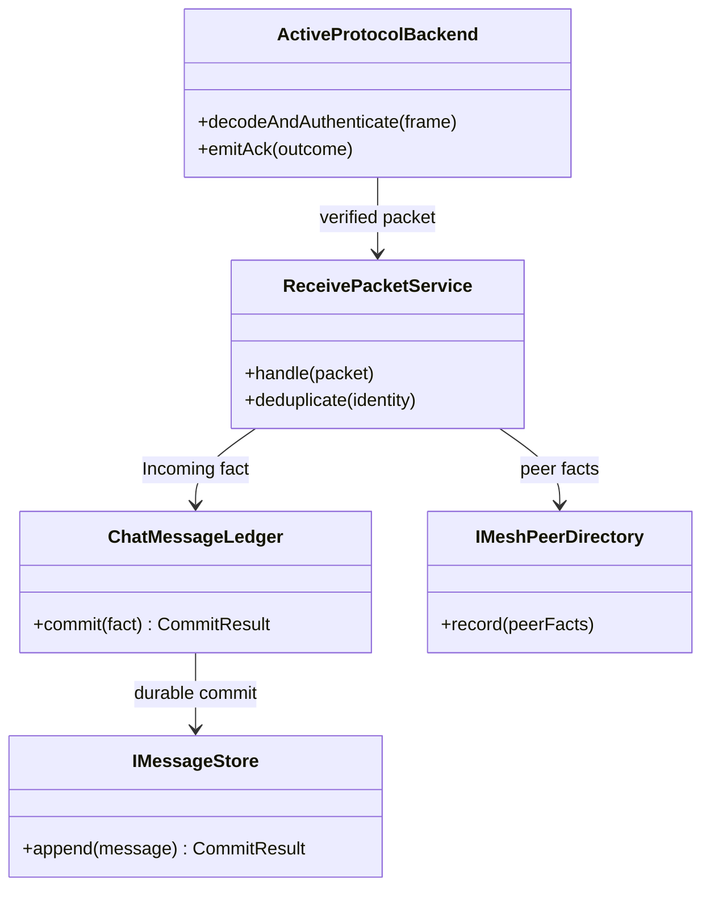

# Class Collaboration：接收职责边界

协议 backend 拥有 wire validation；Receive service 拥有接收用例；Ledger 拥有消息状态合并；Store 不决定业务终态。

## 职责分配

| 协作者 | 拥有 | 明确不拥有 |
| --- | --- | --- |
| ActiveProtocolBackend | framing、目标、crypto、协议 ACK | 会话未读、业务终态 |
| ReceivePacketService | 接收编排、protocol-scoped dedup、peer/message 组合 | wire parsing、持久化实现 |
| ChatMessageLedger | 消息身份、状态偏序、commit result | radio、协议编码 |
| IMeshPeerDirectory | protocol-scoped peer facts | 业务联系人跨协议身份 |
| IMessageStore | durable append/revision | Delivered/Failed 业务裁决 |

## 依赖方向

Backend 通过已验证 packet DTO 调用 Receive service；Receive 依赖 Directory 与 Ledger 端口；Ledger 依赖 Store 端口。Store adapter 不反向调用 UI 或 Backend，避免基础设施决定业务状态。

## 数据所有权

大 frame 的生命周期终止在 Backend；跨边界传递的是紧凑且有明确 ownership 的 packet/commit input。Ledger fact 带 protocol namespace、message identity 和 attempt/revision，禁止共享可变 message struct。

## 一致性与失败

Peer observation 与 message commit 是相关但可能独立失败的事实。消息只有 Durable 后发布；Directory 失败按策略重试并保留诊断。Store Deferred 由有界 slot 接管，不阻塞 radio path。

## 测试缝

可替换 Fake Backend、Directory、Ledger/Store 分别验证：wire 无效不进入 use case、dedup 不重复提交、终态合并不由 Store 决定，以及 Deferred 的 ownership 安全。
