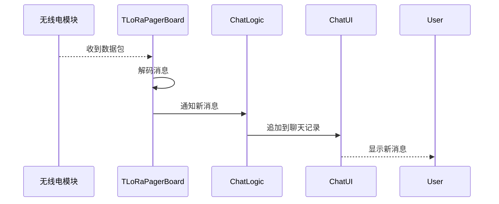

# Sequence Diagram：对象交互：接收文本消息

<!-- praxis:use-case-diagram:start -->

## 元数据

项目版本：0.1.30-alpha
设计文档版本：0.1.30-alpha
Git 分支：main
Git 提交：34aad0bffa2f6450192f655f248a94b6c3cbd767
Git 工作区状态：dirty
Agent 版本决策：none - 本次渲染没有单独的 agent 版本决策
更新于：2026-06-25T14:17:55.307Z
来源：Agent 候选分析
父级 Use Case：use-case:receive-text-message
业务边界路径：Trail Mate 系统 / 聊天通信
父级文档：docs/design/use-case-diagrams/receive-text-message.md
Markdown 路径：docs/design/use-case-diagrams/receive-text-message/sequences/sequence-receive-text-message-sequence.md
HTML 路径：docs/design/use-case-diagrams/receive-text-message/sequences/sequence-receive-text-message-sequence.html

## 交互场景

无缝接收其他用户的消息

## 参与者 / 生命线

- participant Radio as 无线电模块
- participant Board as TLoRaPagerBoard
- participant Logic as ChatLogic
- participant UI as ChatUI

## 消息时序

- Radio-->>Board: 收到数据包
- Board->>Board: 解码消息
- Board->>Logic: 通知新消息
- Logic->>UI: 追加到聊天记录
- UI-->>User: 显示新消息

## 同步 / 异步 / 回调

- Radio-->>Board: 收到数据包
- UI-->>User: 显示新消息

## 返回 / 异常 / 补偿

- Radio-->>Board: 收到数据包
- UI-->>User: 显示新消息

## 事务 / 幂等 / 重试边界

采用观察者模式，Board 作为事件源，ChatLogic 订阅

- 无

## Sequence UML 读图说明

硬件中断驱动，经过 Board 和 Logic，到达 UI

## 实现范围锚点

- 模块：boards
- 模块：apps/linux_uconsole_gtk
- 关键文件：boards/tlora_pager/src/tlora_pager_board.cpp
- 关键文件：apps/linux_uconsole_gtk/src/platform/gtk/gtk_uconsole_chat_logic.cpp
- 代码锚点：boards/tlora_pager/src/tlora_pager_board.cpp#L1
- 不覆盖代码：非当前场景的全部调用链
- 不覆盖代码：未被证据支持的异步/补偿路径

## 不覆盖场景

- 消息回调线程安全
- 离线消息

## Mermaid 图

## 证据上下文

| 来源 | 路径 | 行号 | 强度 | 摘要 |
| --- | --- | --- | --- | --- |
| 本地仓库扫描 | boards/tlora_pager/src/tlora_pager_board.cpp | 1-1 | strong | 接收消息函数 |
| 本地仓库扫描 | boards/tlora_pager/src/tlora_pager_board.cpp | 1-1 | strong | 消息接收和无线电解码相关方法 |

## 变更记录

### 0.1.30-alpha - 2026-06-25T14:17:55.307Z

变更类型：DISCOVERY
版本决策：none - 本次渲染没有单独的 agent 版本决策

Git 分支：main
Git 提交：34aad0bffa2f6450192f655f248a94b6c3cbd767
Git 工作区状态：dirty

摘要：
- 恢复或更新「接收文本消息」的 Sequence Diagram。

<!-- praxis:use-case-diagram:end -->
