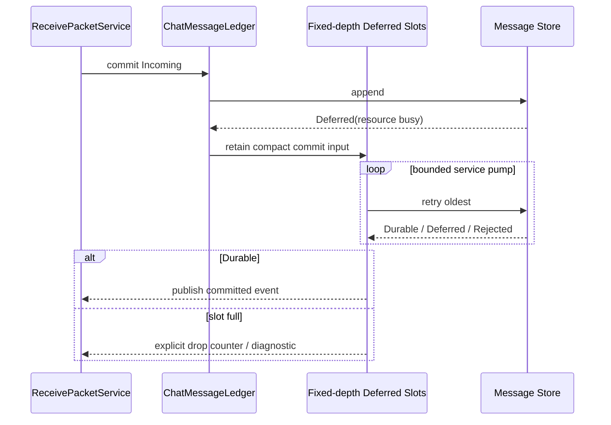

# Sequence Diagram：Deferred 存储恢复

## 为什么需要 Deferred

Receive 运行在受时间和栈预算约束的路径，Message Store 可能因存储 owner、锁或暂时资源不足无法立即提交。Deferred 允许把紧凑 commit input 转移到有界 worker，而不是阻塞 radio callback。

## Slot 所有权

Slot 保存稳定 message identity、必要的小型元数据和对 payload 的明确所有权；不得复制大型 frame 到 ESP 任务栈。采用固定深度 FIFO/ring，并说明满时 drop-new、drop-old 或拒绝策略；当前图选择显式计数而非静默覆盖。

## 重试顺序

service pump 先处理最老条目，避免持续新消息饿死旧提交。Durable 后发布一次 committed event 并释放 slot；Deferred 保持原位；Rejected 释放并记录不可重试原因。

## 崩溃与重启

RAM slot 不承诺跨重启存活。若产品要求不丢消息，需要 durable inbox/journal，而不是把 Deferred 文案当成持久化保证。诊断区分存储拒绝和 slot overflow。

## 测试

覆盖连续 Deferred、FIFO 公平性、slot 满、payload 生命周期、重复 pump、Store 恢复和发布回调失败。
