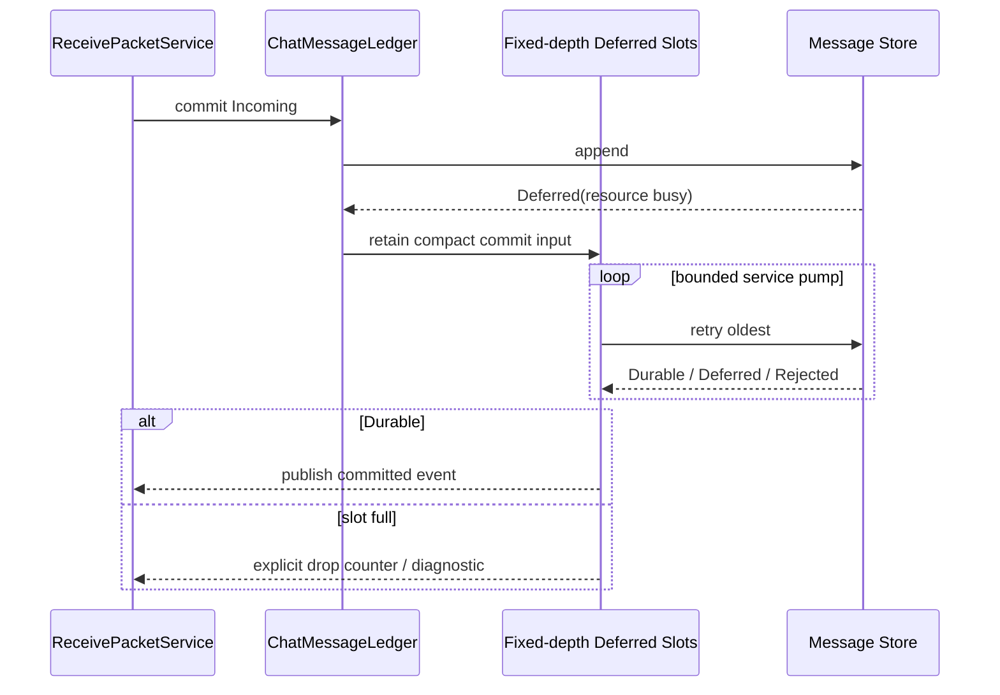

# Sequence Diagram: Deferred storage recovery

## Why Deferred is needed

Receive runs in a path subject to time and stack budget constraints, and the Message Store may not be able to commit immediately due to insufficient storage owners, locks, or temporary resources. Deferreds allow moving compact commit inputs to bounded workers instead of blocking radio callbacks.

## Slot ownership

Slot holds stable message identity, necessary small metadata, and clear ownership of the payload; large frames must not be copied to the ESP task stack. Use a fixed-depth FIFO/ring and specify a drop-new, drop-old, or reject policy when full; choose explicit counting instead of silent coverage for the current graph.

## Retry sequence

service pump processes the oldest entries first to avoid starving old submissions of new messages. Durable releases a committed event and releases the slot; Deferred remains in place; Rejected releases and records the reason why it cannot be retried.

## Crashes and Reboots

RAM slots are not promised to survive across reboots. If the product requires no message loss, durable inbox/journal is needed instead of using Deferred copy as a durability guarantee. Diagnostics distinguish between storage rejection and slot overflow.

## test

 Covers continuous Deferred, FIFO fairness, slot full, payload life cycle, repeated pump, Store recovery and publishing callback failure.
