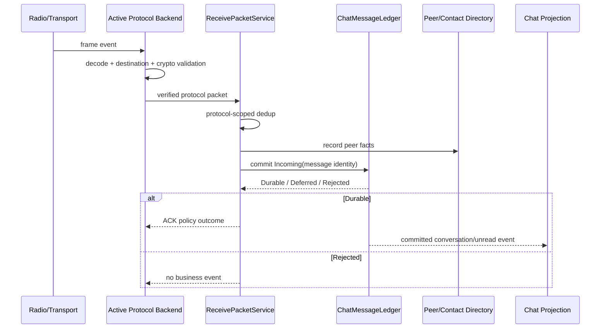

# Sequence Diagram: Radio to Ledger

## Scenarios and responsibilities

Radio/Transport generates the original frame; the activity Backend is responsible for the protocol structure, target and crypto; ReceivePacketService only receives packets that have passed protocol verification, and performs business deduplication and combined submission; Ledger is the message final state owner; Directory has peer observation; UI only receives committed projection.

## Sequence constraints

Protocol verification occurs before any business is written. Dedup key contains protocol namespace. Peer facts and message submission need to have a clear consistency strategy: if directory writing failure does not affect the authenticity of the message, it can be retried as an independent fact; conversation/unread must not be published when the message is not Durable.

## ACK semantics

After the business becomes Durable, Backend can send a successful ACK according to the protocol policy. Duplicate messages do not need to be re-established, but the ACK may still be resent. Rejected does not generate business events; whether the protocol layer returns NACK is determined by the wire contract.

## Out-of-order and late

The message arrival order is not equal to the session display order, and the projection is processed according to the protocol sequence number/message time and stable identity. Late events for inactive backends with generation,are rejected by the ingress instead of being written to the,current protocol space.

## Verification

 Covers decode/crypto failures, cross-protocol key conflicts, duplicate packets, Directory failures, Ledger Deferred/Rejected, and ACKs are only generated in the allowed phase.
