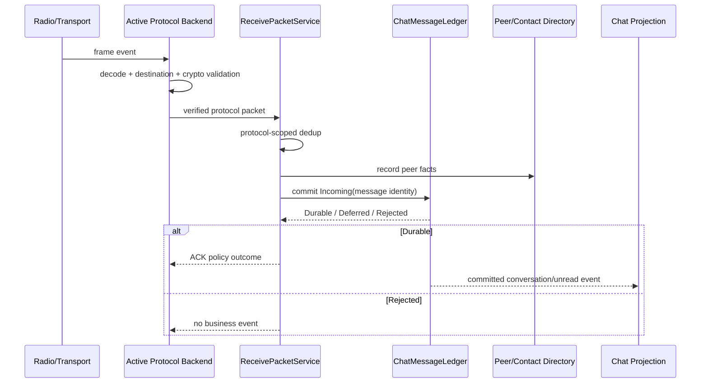

# Sequence Diagram：Radio 到 Ledger

## 场景与责任

Radio/Transport 产生原始 frame；活动 Backend 负责协议结构、目标和 crypto；ReceivePacketService 只接收已经通过协议验证的 packet，执行业务去重与组合提交；Ledger 是消息终态 owner；Directory 拥有 peer 观察；UI 只接收 committed projection。

## 顺序约束

协议验证发生在任何业务写入前。Dedup key 包含协议 namespace。Peer facts 与消息提交需要明确一致性策略：若目录写失败不影响消息真实性，可作为独立事实重试；消息未 Durable 时绝不能发布 conversation/unread。

## ACK 语义

业务 Durable 后 Backend 才能根据协议策略发送成功 ACK。重复消息可以不重复建消息，但仍可能重发 ACK。Rejected 不产生业务事件；协议层是否返回 NACK 由 wire contract 决定。

## 乱序与迟到

消息到达顺序不等于会话显示顺序，投影按协议序号/消息时间和稳定 identity 处理。非活动 backend 的迟到事件带 generation，被入口拒绝而不是写入当前协议空间。

## 验证

覆盖 decode/crypto 失败、跨协议 key 冲突、重复 packet、Directory 失败、Ledger Deferred/Rejected 以及 ACK 仅在允许阶段产生。
