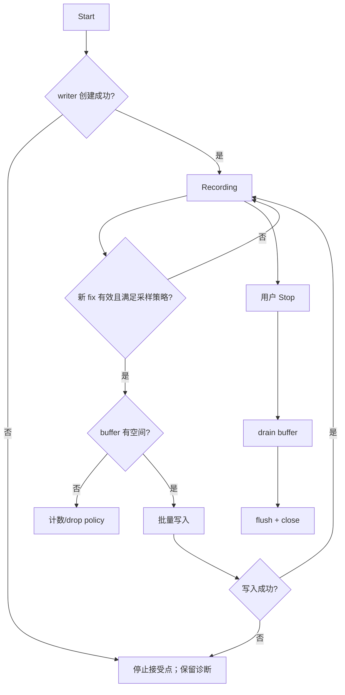

# Activity：轨迹记录与关闭

## 本图回答的问题

一次轨迹记录如何从创建 writer 开始，在有限内存与可能繁忙的存储上持续接收定位点，并在 Stop 时保证已接受的数据得到明确处理。

## 会话与采样

Start 创建唯一 recording session 和 writer。只有可信 fix 且满足时间/距离采样策略的点进入固定容量 buffer。无效 fix 或未达到采样门槛不算 drop，也不改变会话健康状态。

## 缓冲与背压

buffer 满时执行显式 drop policy 并累计计数；不得覆盖尚未写出的点或在 GNSS 回调中阻塞等待 SD。storage worker 批量取点，writer 是文件格式和 flush/close 的唯一 owner。

## 错误与停止

写入失败后立即停止接受新点，保留失败原因、已写点数和 drop 计数。用户 Stop 是受控关闭：先禁止新入队，再 drain 已接受 buffer，最后 flush + close。Close 完成才可以报告轨迹文件稳定可用。

## 重复事件与重启

重复 Stop 必须幂等；Stop 与写入失败竞争时只执行一次 close。应用重启后未正常 close 的文件需要格式级恢复或明确标为 incomplete，不能假定最后缓冲区已写入。

## ESP 栈与所有权

轨迹点批次、文件缓冲和协议对象不能作为大型自动局部变量放在任务栈上；使用固定深度成员 ring、caller-provided storage 或明确静态所有权。

## 测试

覆盖 writer 创建失败、采样过滤、buffer 满、部分写、Stop 时仍有点、重复 Stop、SD 移除及 incomplete 文件恢复。
