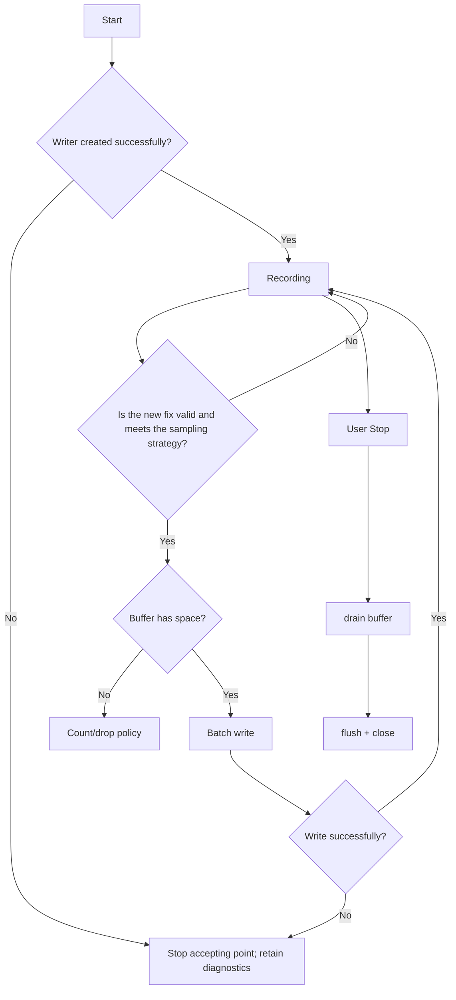

# Activity: Track recording and closing

## Questions answered by this picture

How a trace record starts from creating a writer, continues to receive anchor points on limited memory and potentially busy storage, and ensures that the accepted data is clearly processed when Stop.

## Sessions and Sampling

Start creates a unique recording session and writer. Only points with credible fixes and satisfying the time/distance sampling strategy enter the fixed capacity buffer. Invalid fixes or failure to reach the sampling threshold are not considered drops and do not change the session health status.

## Buffering and backpressure

Explicit drop policy is executed when the buffer is full and the count is accumulated; points not yet written out must not be overwritten or blocked in GNSS callbacks waiting for SD. The storage worker fetches points in batches, and the writer is the only owner of the file format and flush/close.

## Error and Stop

Stop accepting new points immediately after writing failure, retaining the failure reason, number of written points and drop count. User Stop is a controlled shutdown: first prohibit new entries into the queue, then drain the accepted buffer, and finally flush + close. Only after Close is completed can the trajectory file be reported to be stable and available.

## Repeated events and restarts

 Repeated Stop must be idempotent; only close will be executed once when Stop competes with write failure. Files that are not closed properly after an application restart require format-level recovery or are explicitly marked as incomplete, and the last buffer cannot be assumed to have been written.

## ESP stack and ownership

Trajectory point batches, file buffers, and protocol objects cannot be placed on the task stack as large automatic local variables; use fixed-depth member rings, caller-provided storage, or explicit static ownership.

## test

 Covers writer creation failure, sampling filtering, buffer full, partial writing, still a bit when Stop, repeated Stop, SD removal and incomplete file recovery.
