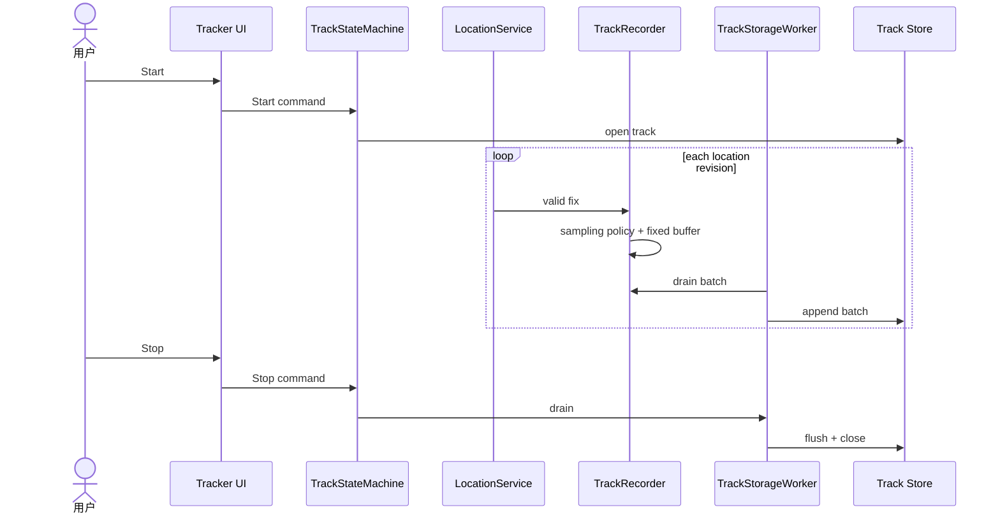

# Sequence：Location 到 Track Store

## 场景与参与者

TrackStateMachine 拥有会话状态，LocationService 发布 revision，Recorder 执行采样与固定缓冲，Worker 是唯一存储写入者，Store 拥有文件格式和 durable close。

## 启动顺序

Start 只有在 Store open 成功后进入 Recording。UI 按状态机提交结果显示正在记录，不能先画红点再等待文件创建。相同 Start 在活动会话中被拒绝或幂等返回现有 session。

## 数据交接

Location callback 只完成验证、采样判定和有界 enqueue，不执行 SD I/O。Worker 批量 drain，成功后推进 durable point count；部分写必须返回已提交范围，不能重复追加整批。

## Stop 栅栏

Stop 先关闭 Recorder 的入队 gate，再等待 Worker drain，最后 flush + close。Close 完成事件才使状态机进入 Completed。写失败与 Stop 竞争时共享一次终结路径。

## 测试

覆盖 open 失败、重复 Start、采样 drop、部分批写、Stop 栅栏、close 失败、掉电后的 incomplete 状态和固定 buffer 所有权。
